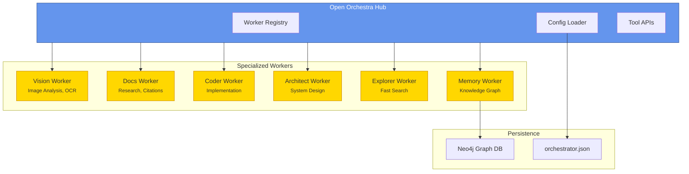
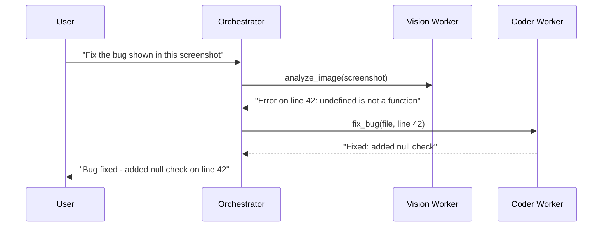
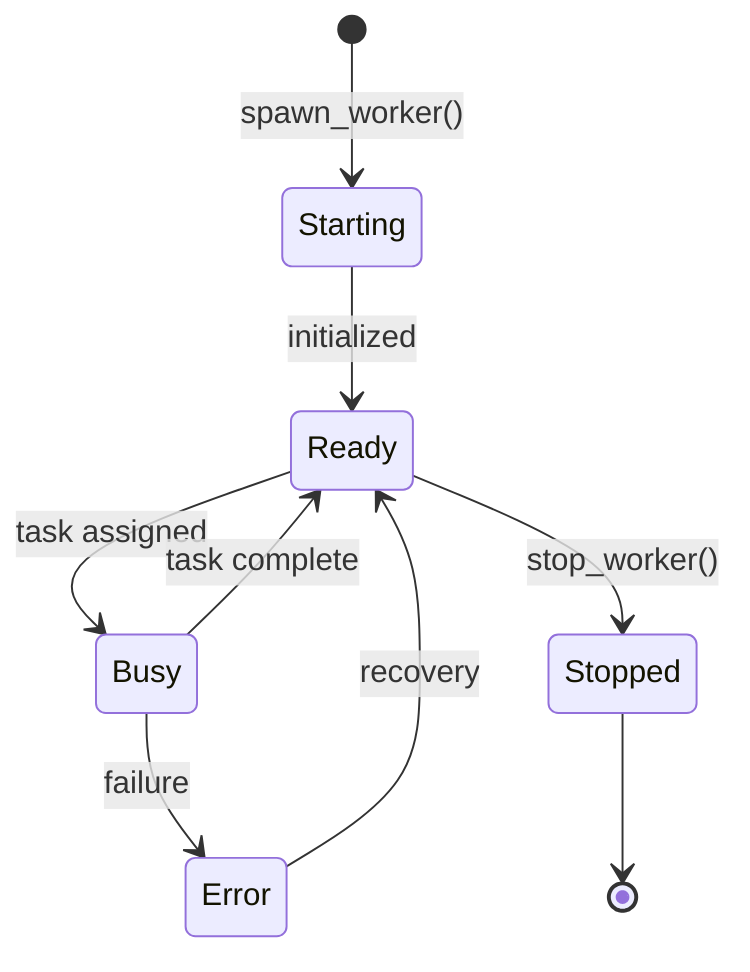

<p align="center">
  <svg xmlns="http://www.w3.org/2000/svg" viewBox="0 0 400 120" width="400" height="120">
    <defs>
      <linearGradient id="grad1" x1="0%" y1="0%" x2="100%" y2="100%">
        <stop offset="0%" style="stop-color:#6495ED;stop-opacity:1" />
        <stop offset="100%" style="stop-color:#4169E1;stop-opacity:1" />
      </linearGradient>
      <linearGradient id="grad2" x1="0%" y1="0%" x2="100%" y2="0%">
        <stop offset="0%" style="stop-color:#FFD700;stop-opacity:1" />
        <stop offset="100%" style="stop-color:#FFA500;stop-opacity:1" />
      </linearGradient>
    </defs>
    <!-- Central Hub -->
    <circle cx="60" cy="60" r="35" fill="url(#grad1)" stroke="#2F4F8F" stroke-width="2"/>
    <text x="60" y="65" text-anchor="middle" fill="white" font-size="12" font-weight="bold" font-family="system-ui">HUB</text>
    <!-- Spokes -->
    <line x1="95" y1="60" x2="130" y2="30" stroke="#4169E1" stroke-width="2" stroke-dasharray="4"/>
    <line x1="95" y1="60" x2="130" y2="60" stroke="#4169E1" stroke-width="2" stroke-dasharray="4"/>
    <line x1="95" y1="60" x2="130" y2="90" stroke="#4169E1" stroke-width="2" stroke-dasharray="4"/>
    <!-- Worker Nodes -->
    <circle cx="145" cy="30" r="15" fill="url(#grad2)" stroke="#CC8400" stroke-width="1.5"/>
    <circle cx="145" cy="60" r="15" fill="url(#grad2)" stroke="#CC8400" stroke-width="1.5"/>
    <circle cx="145" cy="90" r="15" fill="url(#grad2)" stroke="#CC8400" stroke-width="1.5"/>
    <!-- Title -->
    <text x="185" y="50" fill="#333" font-size="28" font-weight="bold" font-family="system-ui">Open</text>
    <text x="260" y="50" fill="#6495ED" font-size="28" font-weight="bold" font-family="system-ui">Orchestra</text>
    <text x="185" y="75" fill="#666" font-size="14" font-family="system-ui">Multi-Agent Orchestration for OpenCode</text>
  </svg>
</p>

<p align="center">
  <a href="https://github.com/0xSero/open-orchestra/releases"></a>
  <a href="https://github.com/0xSero/open-orchestra/blob/main/LICENSE"></a>
  <a href="https://bun.sh"></a>
  <a href="https://opencode.ai"></a>
</p>

<p align="center">
  <strong>Spawn, manage, and coordinate specialized AI workers in OpenCode</strong>
</p>

---

## Overview

**Open Orchestra** is a monorepo that ships the orchestrator plugin, control panel, and desktop shell for OpenCode.

### Repo in 10 minutes

Mental model:
- **Workers**: orchestrator-managed runtimes that do the work.
- **Workflows**: multi-step plans the orchestrator runs across workers.
- **Memory**: persistent records written by workflows and tools.

The 3 commands:
- `bun run dev` — developer loop (plugin watch + control panel)
- `bun run build` — release build (plugin + app + desktop)
- `opencode` + plugin install — user flow (add `opencode-orchestrator` to OpenCode config)

---

**Open Orchestra** is a multi-agent orchestration plugin for [OpenCode](https://opencode.ai) that enables you to spawn, manage, and coordinate specialized AI workers. It implements a **hub-and-spoke architecture** where a central orchestrator coordinates multiple specialized workers, each optimized for specific tasks.

### Why Multiple AI Workers?

Instead of asking one AI to do everything, Open Orchestra lets you use specialized workers:

| Worker | Best For | Example |
|--------|----------|---------|
| **Vision** | Analyzing screenshots, images, UI mockups | "What error is shown in this screenshot?" |
| **Docs** | Researching APIs, finding examples | "How do I use React's useEffect hook?" |
| **Coder** | Writing and modifying code | "Implement this feature" |
| **Architect** | System design, planning (read-only) | "Review this architecture" |

This specialization means better results, clearer reasoning, and the ability to run tasks in parallel.

## Prerequisites

Before installing Open Orchestra, verify you have:

| Requirement | Check Command | Expected |
|-------------|---------------|----------|
| Bun runtime | `bun --version` | 1.0.0 or higher |
| OpenCode CLI | `opencode --version` | Any recent version |
| AI Provider | `orchestrator.models` (in OpenCode) | At least one model listed |

**Quick verification:**

```bash
bun --version && opencode --version
```

**Need to configure a provider?** Add to `~/.config/opencode/opencode.json`:

```json
{
  "provider": {
    "anthropic": {
      "apiKey": "sk-ant-your-key-here"
    }
  }
}
```

See the [Quickstart Guide](./docs/quickstart.md) for detailed setup instructions.

### Key Features

- **6 Built-in Worker Profiles** - Vision, Docs, Coder, Architect, Explorer, Memory
- **Hub-and-Spoke Architecture** - Central orchestrator with specialized workers
- **5-tool Async Task API** - Start/await/peek/list/cancel tasks (workers + workflows)
- **Profile-Based Spawning** - Auto-model resolution from OpenCode config
- **Dynamic Port Allocation** - Avoids conflicts with automatic port assignment
- **Session-Based Isolation** - Each worker maintains its own conversation context
- **Optional Neo4j Memory** - Persistent knowledge graph (advanced feature)

## Architecture

Open Orchestra follows a hub-and-spoke pattern inspired by successful multi-agent systems like AutoGen and LangGraph, but optimized for OpenCode's plugin architecture.



## Quick Start

### Installation

```bash
# Add to your project
bun add opencode-orchestrator

# Or install globally
bun add -g opencode-orchestrator
```

### Configuration

**1. Add the plugin to OpenCode:**

```json
// opencode.json or ~/.config/opencode/opencode.json
{
  "plugin": ["opencode-orchestrator"]
}
```

**2. Create orchestrator config (optional - auto-setup available):**

```json
// .opencode/orchestrator.json or orchestrator.json
{
  "$schema": "./node_modules/opencode-orchestrator/schema/orchestrator.schema.json",
  "autoSpawn": true,
  "workers": ["vision", "docs", "coder"]
}
```

### Basic Usage



**Start tasks (async):**
```bash
task_start({ kind: "worker", workerId: "vision", task: "What's in this image?", attachments: [...] })
task_await({ taskId: "<taskId>" })
```

**Auto-route tasks:**
```bash
task_start({ kind: "auto", task: "Find the official React hooks documentation" })
task_await({ taskId: "<taskId>" })
```

## Workflows

Workflows run multi-step sequences with security limits:

```bash
list_workflows({ format: "markdown" })
run_workflow({ workflowId: "roocode-boomerang", task: "Implement the new workflow tools" })
```

Command shortcuts:

- `orchestrator.workflows`
- `orchestrator.boomerang`

## Built-in Profiles

| Profile | Model Tag | Vision | Web | Purpose |
|---------|-----------|--------|-----|---------|
| `vision` | `auto:vision` | Yes | No | Image analysis, OCR, UI review |
| `docs` | `auto:docs` | No | Yes | Documentation research, examples, citations |
| `coder` | `auto` | No | No | Code implementation, file operations |
| `architect` | `auto` | No | No | System design, planning (read-only) |
| `explorer` | `auto:fast` | No | No | Fast codebase searches |
| `memory` | `auto` | No | Yes | Neo4j memory graph, context pruning |

## Worker Lifecycle



## Documentation

### Getting Started
- [Quickstart](./docs/quickstart.md) - Your first worker in 5 minutes
- [Examples](./docs/examples.md) - Real-world use cases and workflows
- [Troubleshooting](./docs/troubleshooting.md) - Common issues and fixes

### Reference
- [Configuration](./docs/configuration.md) - Complete configuration reference
- [Guide](./docs/guide.md) - Profiles, workflows, and advanced features
- [Tool Reference](./docs/reference.md) - All tools with examples

### Deep Dive
- [Architecture](./docs/architecture.md) - System design and patterns
- [CHANGELOG](./CHANGELOG.md) - Version history and changes

## Tools

| Tool | Description |
|------|-------------|
| `task_start` | Start a worker/workflow task (async; returns `taskId`) |
| `task_await` | Wait for a task to finish (returns final job record) |
| `task_peek` | Inspect task status without waiting |
| `task_list` | List recent tasks |
| `task_cancel` | Cancel a running task (best-effort) |
| `spawn_worker` | Start a worker with a profile |
| `ask_worker` | Send a message to a specific worker |
| `delegate_task` | Auto-route task to the best worker |
| `list_workers` | List running workers (use `workerId` for details) |
| `stop_worker` | Stop a running worker |
| `list_profiles` | Show available worker profiles |
| `list_models` | Show available models from OpenCode config |
| `orchestrator_status` | Show orchestrator config and status |
| `list_workflows` | List registered workflows |
| `run_workflow` | Run a workflow by id |

### Commands

| Command | Description |
|---------|-------------|
| `orchestrator.status` | Show workers, profiles, and config |
| `orchestrator.models` | List available models |
| `orchestrator.profiles` | List worker profiles |
| `orchestrator.workers` | List running workers |
| `orchestrator.output` | Show recent tasks + logs |
| `orchestrator.workflows` | List workflows |
| `orchestrator.boomerang` | Run the RooCode boomerang workflow |

## Advanced: Memory System (Optional)

Open Orchestra includes an optional Neo4j-backed memory system for persistent knowledge storage. See the memory section in [Guide](./docs/guide.md) for setup instructions.

## Development

See [docs/standards.md](./docs/standards.md) for engineering standards and [docs/testing.md](./docs/testing.md) for test tiers and CI behavior.

```bash
# Install dependencies
bun install
cd app && bun install
cd desktop && bun install

# Run the full quality gate
bun run check
```

## Project Structure

```
opencode-orchestrator/
├── bin/
│   └── worker-bridge-plugin.mjs
├── src/
│   ├── index.ts              # Plugin entry point
│   ├── command/
│   │   ├── index.ts          # Tool registry
│   │   ├── workers.ts        # Worker commands
│   │   └── workflows.ts      # Workflow commands
│   ├── config/
│   │   ├── orchestrator.ts   # Config loading/merging
│   │   └── profiles.ts       # Built-in worker profiles
│   ├── core/
│   │   ├── runtime.ts        # Runtime lifecycle
│   │   └── worker-pool.ts    # Worker registry + pooling
│   ├── memory/
│   │   ├── graph.ts          # Memory graph operations
│   │   └── neo4j.ts          # Neo4j connection
│   ├── models/
│   │   ├── catalog.ts        # Model catalog utilities
│   │   └── hydrate.ts        # Model resolution
│   ├── types/
│   │   └── index.ts          # TypeScript definitions
│   ├── ux/
│   │   ├── idle-notification.ts
│   │   └── pruning.ts        # Context pruning
│   └── workers/
│       ├── prompt.ts         # Prompt building
│       └── spawner.ts        # Worker lifecycle
├── schema/
│   └── orchestrator.schema.json
├── docs/
│   ├── architecture.md
│   ├── guide.md
│   └── reference.md
└── test/
    ├── e2e.test.ts
    └── orchestrator.test.ts
```

## Contributing

Contributions are welcome! Please read [CONTRIBUTING.md](./CONTRIBUTING.md) and submit PRs to the `main` branch.

## License

MIT - see [LICENSE](./LICENSE) for details.

---

<p align="center">
  Built for <a href="https://opencode.ai">OpenCode</a> with orchestration patterns inspired by multi-agent systems research.
</p>
