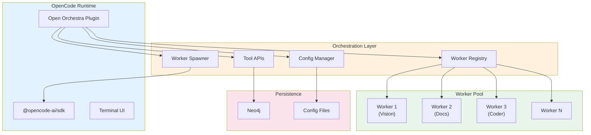
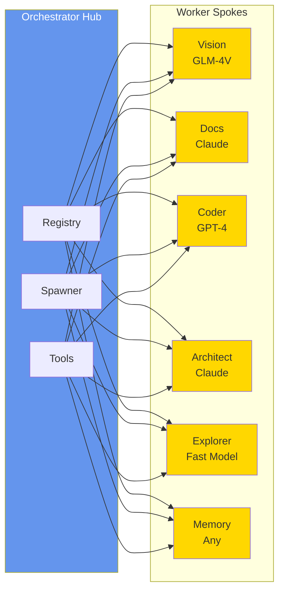
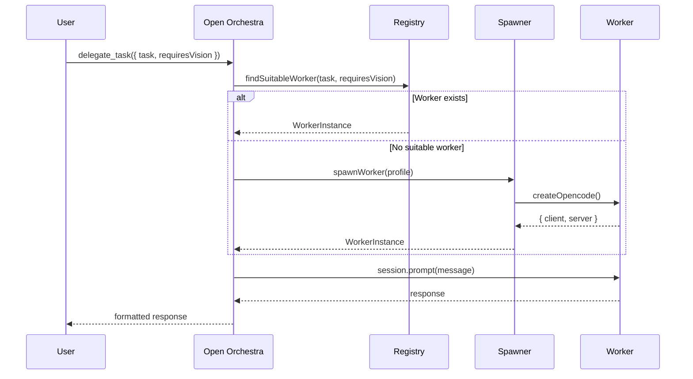
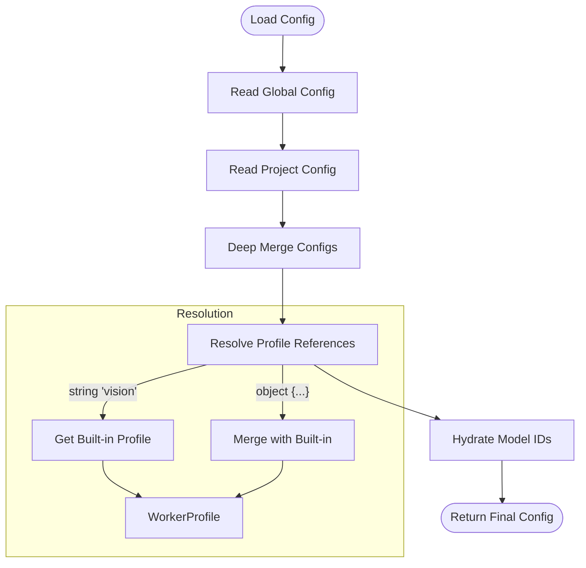
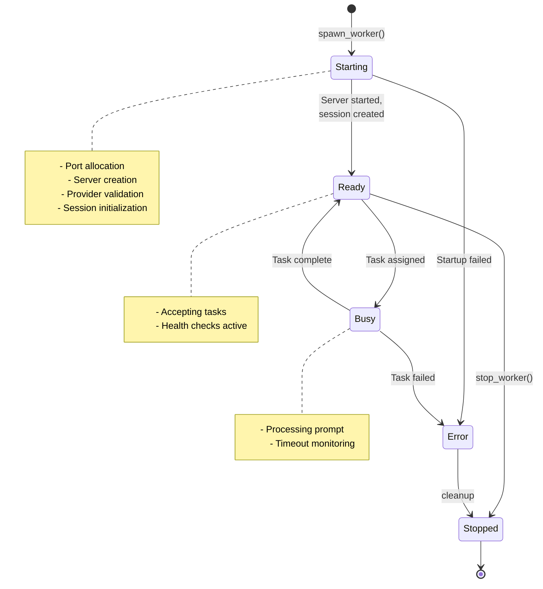
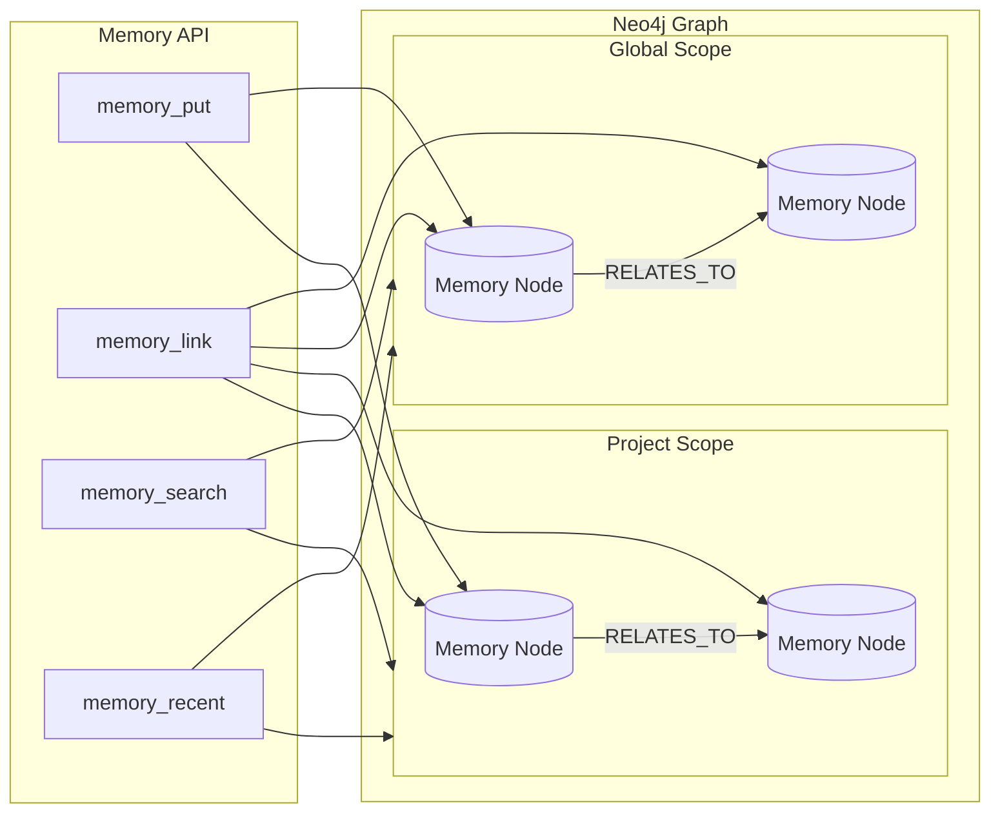
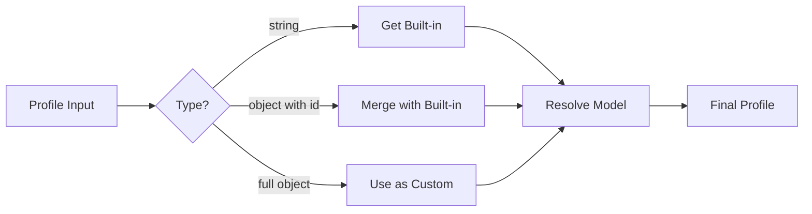

# Architecture Deep Dive

This document provides a comprehensive overview of Open Orchestra's architecture, design patterns, and implementation details.

## Table of Contents

- [System Overview](#system-overview)
- [Hub-and-Spoke Pattern](#hub-and-spoke-pattern)
- [Component Architecture](#component-architecture)
- [Data Flow](#data-flow)
- [Worker Lifecycle](#worker-lifecycle)
- [Memory System](#memory-system)
- [Configuration System](#configuration-system)
- [Context Management](#context-management)

## System Overview

Open Orchestra implements a **multi-agent orchestration system** built as an OpenCode plugin. The architecture follows a hub-and-spoke pattern where a central orchestrator coordinates specialized workers, each optimized for specific tasks.



## Hub-and-Spoke Pattern

The hub-and-spoke architecture provides several advantages:

### Central Coordination (Hub)

The orchestrator acts as the central hub, responsible for:

1. **Worker Registry** - Tracking all spawned workers and their capabilities
2. **Task Routing** - Determining which worker should handle a given task
3. **Lifecycle Management** - Spawning, monitoring, and stopping workers
4. **Context Injection** - Providing workers with necessary context

### Specialized Workers (Spokes)

Each worker is a dedicated OpenCode instance with:

1. **Dedicated Session** - Isolated conversation context
2. **Specialized Model** - Optimized for specific tasks (vision, speed, etc.)
3. **Custom System Prompt** - Task-specific instructions
4. **Tool Restrictions** - Limited tools for safety (e.g., architect is read-only)



## Component Architecture

### Core Components

#### 1. Plugin Entry (`src/index.ts`)

The main plugin export that:
- Loads and merges configuration
- Initializes the registry and spawner
- Registers tools with OpenCode
- Sets up event handlers and UX hooks

```typescript
export const OrchestratorPlugin: Plugin = async (ctx) => {
  // Load config
  const { config, sources } = await loadOrchestratorConfig({...});
  
  // Initialize subsystems
  setDirectory(ctx.directory);
  setClient(ctx.client);
  setProfiles(config.profiles);
  
  // Auto-spawn workers if configured
  if (config.autoSpawn && config.spawn.length > 0) {
    await spawnWorkers(profilesToSpawn, options);
  }
  
  return {
    tool: orchestratorTools,
    config: async (opencodeConfig) => { /* inject agents/commands */ },
    "experimental.chat.system.transform": async (_, output) => { /* inject context */ },
    "experimental.chat.messages.transform": pruneTransform,
    event: idleNotifier,
  };
};
```

#### 2. Worker Registry (`src/core/registry.ts`)

Singleton registry that tracks all worker instances:

```typescript
class WorkerRegistry {
  workers: Map<string, WorkerInstance>;
  
  register(instance: WorkerInstance): void;
  unregister(id: string): boolean;
  getWorker(id: string): WorkerInstance | undefined;
  getWorkersByCapability(capability: string): WorkerInstance[];
  getActiveWorkers(): WorkerInstance[];
  getVisionWorkers(): WorkerInstance[];
  updateStatus(id: string, status: WorkerStatus, error?: string): void;
  getSummary(options?: SummaryOptions): string;
}
```

#### 3. Worker Spawner (`src/workers/spawner.ts`)

Handles worker lifecycle:

```typescript
// Spawn a new worker
async function spawnWorker(
  profile: WorkerProfile,
  options: SpawnOptions
): Promise<WorkerInstance>;

// Connect to existing worker
async function connectToWorker(
  profile: WorkerProfile,
  port: number
): Promise<WorkerInstance>;

// Send message to worker
async function sendToWorker(
  workerId: string,
  message: string,
  options?: { attachments?: WorkerAttachment[]; timeout?: number }
): Promise<{ success: boolean; response?: string; error?: string }>;

// Spawn multiple workers in parallel
async function spawnWorkers(
  profiles: WorkerProfile[],
  options: SpawnOptions
): Promise<{ succeeded: WorkerInstance[]; failed: FailedSpawn[] }>;
```

#### 4. Configuration System (`src/config/`)

Two-layer configuration with global and project overrides:

```
~/.config/opencode/orchestrator.json  (global)
.opencode/orchestrator.json           (project - takes precedence)
orchestrator.json                     (project root - fallback)
```

Configuration is deeply merged with profiles resolved to full objects.

#### 5. Tool APIs (`src/command/index.ts`)

22+ tools organized into categories:

| Category | Tools |
|----------|-------|
| Worker Management | `spawn_worker`, `stop_worker`, `ensure_workers`, `list_workers`, `get_worker_info` |
| Task Delegation | `delegate_task`, `ask_worker`, `find_worker` |
| Configuration | `list_models`, `list_profiles`, `set_profile_model`, `set_autospawn`, `autofill_profile_models`, `orchestrator_config`, `set_orchestrator_agent` |
| Memory | `memory_put`, `memory_link`, `memory_search`, `memory_recent` |
| Help | `orchestrator_help` |

## Data Flow

### Task Delegation Flow



### Configuration Loading Flow



## Worker Lifecycle

Workers progress through defined states:



### Startup Sequence

1. **Port Allocation** - Dynamic port (0) or fixed port from profile
2. **Server Creation** - `createOpencode()` starts new OpenCode instance
3. **Provider Validation** - Verify model/provider availability
4. **Session Creation** - Create dedicated session for worker
5. **System Prompt Injection** - Set up worker's specialized context
6. **Registry Update** - Mark worker as ready

## Memory System

The memory system uses Neo4j for persistent knowledge storage:



### Memory Node Structure

```typescript
type MemoryNode = {
  scope: "global" | "project";
  projectId?: string;      // Only for project scope
  key: string;             // Stable identifier (e.g., "architecture:db")
  value: string;           // The stored knowledge
  tags: string[];          // Searchable tags
  createdAt?: number;
  updatedAt?: number;
};
```

### Graph Operations

| Operation | Cypher Pattern |
|-----------|----------------|
| Upsert | `MERGE (n:Memory {scope, projectId, key}) SET n.value = $value` |
| Link | `MATCH (a:Memory), (b:Memory) MERGE (a)-[:RELATES_TO]->(b)` |
| Search | `MATCH (n:Memory) WHERE ... CONTAINS ... RETURN n` |
| Recent | `MATCH (n:Memory) ORDER BY n.updatedAt DESC LIMIT $limit` |

## Configuration System

### Schema

Full JSON Schema available at `schema/orchestrator.schema.json`.

Key sections:

```json
{
  "basePort": 14096,
  "autoSpawn": true,
  "startupTimeout": 30000,
  "healthCheckInterval": 30000,
  
  "ui": {
    "toasts": true,
    "injectSystemContext": true,
    "systemContextMaxWorkers": 12,
    "defaultListFormat": "markdown"
  },
  
  "agent": {
    "enabled": true,
    "name": "orchestrator",
    "model": "provider/model",
    "mode": "primary"
  },
  
  "pruning": {
    "enabled": false,
    "maxToolOutputChars": 12000,
    "maxToolInputChars": 4000
  },
  
  "profiles": [...],
  "workers": [...]
}
```

### Profile Resolution

Profiles can be specified as:

1. **String reference** - References built-in profile by ID
2. **Partial object** - Merges with built-in defaults
3. **Full object** - Custom profile definition



## Context Management

### System Context Injection

When enabled, the registry summary is injected into the chat system prompt:

```markdown
## Available Workers

### Vision Analyst (vision)
- **Status**: available
- **Model**: openrouter/meta-llama/llama-3.2-11b-vision-instruct
- **Purpose**: Analyze images, screenshots, diagrams
- **When to use**: When you need to understand visual content
- **Supports Vision**: Yes

### Documentation Librarian (docs)
...

## How to Use Workers
Use the `ask_worker` tool to send messages to any worker by their ID.
```

### Context Pruning (DCP-Inspired)

For long sessions, the pruning system can truncate large tool outputs:

```typescript
const pruneTransform = createPruningTransform({
  enabled: true,
  maxToolOutputChars: 12000,   // Truncate tool outputs over 12KB
  maxToolInputChars: 4000,     // Truncate tool inputs over 4KB
  protectedTools: ["task", "todowrite", "todoread"]  // Never prune these
});
```

## Extension Points

### Custom Profiles

Add custom profiles in `orchestrator.json`:

```json
{
  "profiles": [
    {
      "id": "ethers-expert",
      "name": "Ethers.js Expert",
      "model": "anthropic/claude-sonnet-4-5",
      "purpose": "Blockchain and Web3 development",
      "whenToUse": "When working with smart contracts or Ethers.js",
      "supportsWeb": true,
      "tags": ["web3", "blockchain", "ethers"]
    }
  ]
}
```

### Custom Commands

The plugin automatically generates spawn commands for each profile:

```
orchestrator.spawn.vision
orchestrator.spawn.docs
orchestrator.spawn.ethers-expert
```

## Performance Considerations

1. **Port Allocation** - Uses port 0 for dynamic allocation, avoiding conflicts
2. **Parallel Spawning** - `spawnWorkers()` spawns multiple workers concurrently
3. **Timeout Management** - Configurable startup and prompt timeouts
4. **Context Size** - Pruning prevents context overflow in long sessions
5. **Registry Events** - Event-driven updates minimize polling

## Security Notes

1. **Isolated Sessions** - Each worker has its own session, preventing cross-contamination
2. **Tool Restrictions** - Profiles like `architect` disable write tools
3. **No Secret Storage** - Memory system explicitly excludes secrets
4. **Local Communication** - Workers communicate via localhost only
