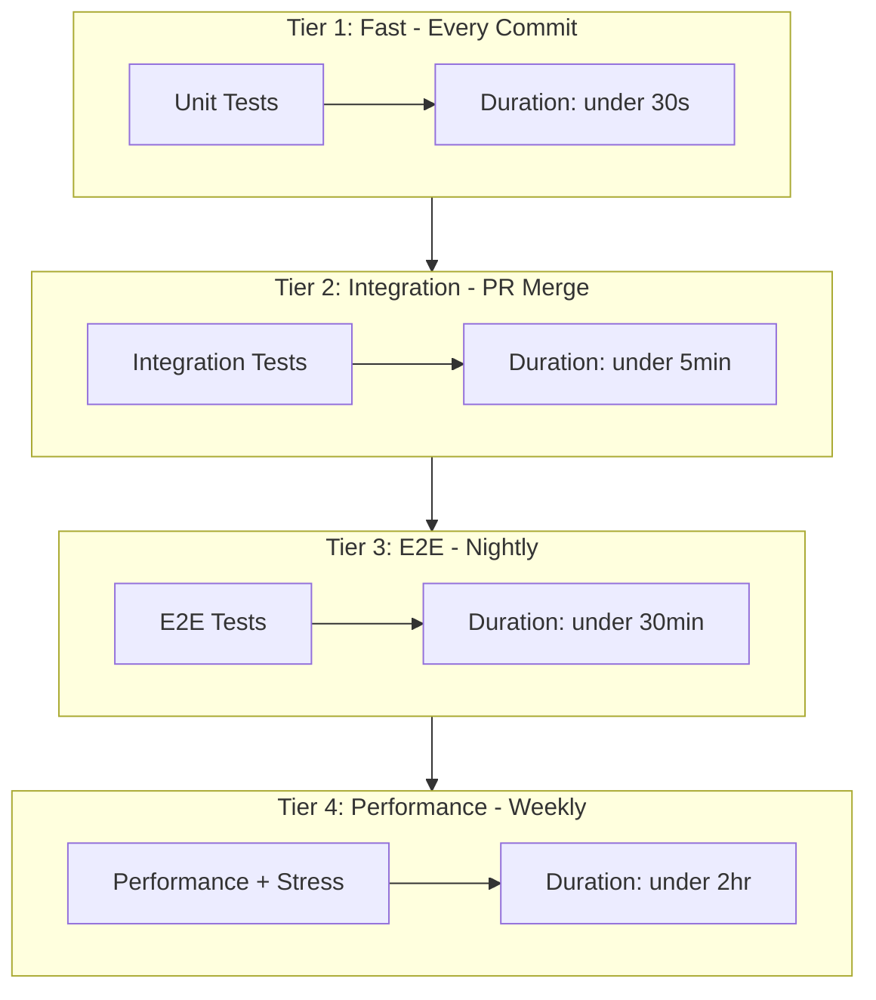
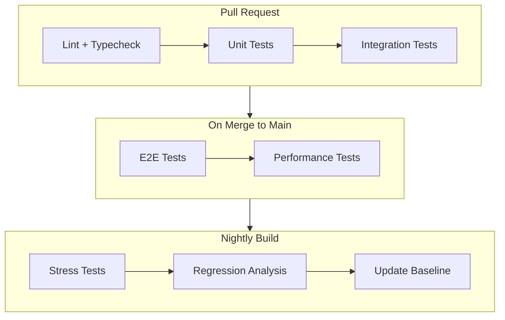

# Test Harness Expansion and Performance Measurement Architecture

## Executive Summary

This document defines a comprehensive test harness architecture for the OpenCode Orchestrator, addressing identified gaps in testing coverage and providing a framework for performance measurement, stress testing, and real-data validation. The design targets six root cause issues identified during the debug phase and fulfills user requirements for intense automated testing with speed measurement.

---

## 1. Test Suite Architecture

### 1.1 Test Categories and Organization

```
test/
├── unit/                           # Fast, isolated tests (no I/O, no spawning)
│   ├── config/
│   │   ├── orchestrator.test.ts    # Config loading, deepMerge, array handling
│   │   └── profiles.test.ts        # Profile resolution, built-in merging
│   ├── models/
│   │   ├── catalog.test.ts         # Model resolution, scoring, fuzzy matching
│   │   └── hydrate.test.ts         # Profile model hydration
│   ├── core/
│   │   ├── registry.test.ts        # In-memory registry operations
│   │   ├── message-bus.test.ts     # Message routing, queue operations
│   │   └── jobs.test.ts            # Job lifecycle, pruning, memory bounds
│   └── workers/
│       └── prompt.test.ts          # Prompt building, response extraction
│
├── integration/                    # Tests that involve multiple components
│   ├── spawn/
│   │   ├── deduplication.test.ts   # Concurrent spawn deduplication
│   │   ├── lifecycle.test.ts       # Spawn -> ready -> stop cycle
│   │   └── reuse.test.ts           # Cross-session worker reuse
│   ├── device-registry/
│   │   ├── persistence.test.ts     # File I/O, pruning dead entries
│   │   └── concurrency.test.ts     # Multi-process registry access
│   └── config/
│       └── merge-layers.test.ts    # Global + project config merging
│
├── e2e/                            # Full system tests with real opencode processes
│   ├── multiagent.test.ts          # Multi-worker coordination (existing)
│   ├── single-worker.test.ts       # Basic spawn and prompt (existing)
│   ├── delegation.test.ts          # Task delegation flow
│   └── recovery.test.ts            # Error recovery, worker restart
│
├── performance/                    # Performance and resource tests
│   ├── spawn-timing.bench.ts       # Spawn latency benchmarks
│   ├── memory-growth.bench.ts      # RSS tracking over time
│   ├── throughput.bench.ts         # Messages per second
│   └── file-io.bench.ts            # Device registry I/O latency
│
├── stress/                         # Stress and chaos testing
│   ├── concurrent-spawns.stress.ts # Race condition detection
│   ├── spawn-storm.stress.ts       # Rapid spawn/stop cycles
│   ├── job-accumulation.stress.ts  # Long-running job memory
│   └── registry-contention.stress.ts # Multi-process file locking
│
├── fixtures/                       # Shared test data
│   ├── configs/
│   │   ├── minimal.json
│   │   ├── complex-merge.json
│   │   └── invalid/
│   ├── providers/
│   │   └── mock-providers.ts
│   └── profiles/
│       └── test-profiles.ts
│
├── helpers/                        # Shared test utilities
│   ├── e2e-env.ts                  # Environment isolation (existing)
│   ├── lock-child.ts               # Lock testing helper (existing)
│   ├── timing.ts                   # Timing utilities and assertions
│   ├── metrics.ts                  # Performance metric collection
│   ├── mock-client.ts              # Mock OpenCode SDK client
│   ├── spawn-helpers.ts            # Spawn orchestration utilities
│   ├── assertions.ts               # Custom test assertions
│   └── cleanup.ts                  # Resource cleanup utilities
│
└── __snapshots__/                  # Snapshot files for regression testing
```

### 1.2 Test File Naming Conventions

| Pattern | Description | Example |
|---------|-------------|---------|
| `*.test.ts` | Standard unit/integration tests | `catalog.test.ts` |
| `*.bench.ts` | Performance benchmarks | `spawn-timing.bench.ts` |
| `*.stress.ts` | Stress/load tests | `concurrent-spawns.stress.ts` |
| `*.e2e.ts` | End-to-end tests | `delegation.e2e.ts` |

### 1.3 Test Execution Tiers



---

## 2. Performance Testing Framework

### 2.1 Metrics Collection Interface

```typescript
// test/helpers/metrics.ts

export interface PerformanceMetrics {
  spawn: {
    latencyMs: number[];        // Time from spawnWorker call to ready
    successRate: number;        // Percentage of successful spawns
    deduplicationHits: number;  // Times in-flight dedup triggered
  };
  memory: {
    rssBytes: number[];         // RSS samples over time
    heapUsedBytes: number[];    // V8 heap usage
    externalBytes: number[];    // External memory (buffers)
    peakRssBytes: number;       // Maximum RSS observed
  };
  io: {
    deviceRegistryReadMs: number[];   // File read latencies
    deviceRegistryWriteMs: number[];  // File write latencies
    lockAcquireMs: number[];          // Profile lock acquisition time
  };
  throughput: {
    messagesPerSecond: number;  // Message bus throughput
    promptsPerMinute: number;   // Worker prompt rate
  };
  jobs: {
    activeCount: number;        // Current active jobs
    completedCount: number;     // Total completed
    avgDurationMs: number;      // Average job duration
    memoryBytesUsed: number;    // Estimated job registry memory
  };
}

export interface MetricsCollector {
  start(): void;
  stop(): PerformanceMetrics;
  sample(): void;                     // Take a point-in-time sample
  getTimeSeries(): TimeSeriesData;    // Get all samples
}

export interface TimeSeriesData {
  timestamps: number[];
  rssBytes: number[];
  heapBytes: number[];
  opencodeProcessCount: number[];
  activeJobs: number[];
}
```

### 2.2 Benchmark Harness

```typescript
// test/helpers/benchmark.ts

export interface BenchmarkConfig {
  name: string;
  warmupIterations: number;
  measureIterations: number;
  setup?: () => Promise<void>;
  teardown?: () => Promise<void>;
  beforeEach?: () => Promise<void>;
  afterEach?: () => Promise<void>;
}

export interface BenchmarkResult {
  name: string;
  iterations: number;
  mean: number;
  median: number;
  p95: number;
  p99: number;
  min: number;
  max: number;
  stdDev: number;
  samples: number[];
}

export async function benchmark(
  config: BenchmarkConfig,
  fn: () => Promise<void>
): Promise<BenchmarkResult>;

export function compareBenchmarks(
  baseline: BenchmarkResult,
  current: BenchmarkResult
): {
  regression: boolean;
  improvementPercent: number;
  significanceLevel: number;
};
```

### 2.3 Performance Thresholds

| Metric | Threshold | Alert Level |
|--------|-----------|-------------|
| Spawn Latency (p95) | < 5000ms | CRITICAL if > 10000ms |
| Memory Growth Rate | < 1MB/min sustained | WARNING if > 5MB/min |
| Device Registry Read | < 50ms (p95) | WARNING if > 100ms |
| Lock Acquisition | < 100ms (p95) | WARNING if > 500ms |
| Job Registry Size | < 200 entries | WARNING if > 500 |
| Process Count | Expected count ±1 | CRITICAL if > expected + 2 |

### 2.4 Baseline Establishment

```typescript
// test/performance/baseline.ts

export interface PerformanceBaseline {
  version: string;
  timestamp: number;
  platform: string;
  metrics: {
    spawnLatency: { p50: number; p95: number; p99: number };
    memoryBaseline: number;
    registryReadLatency: { p50: number; p95: number };
    lockAcquisition: { p50: number; p95: number };
  };
}

export async function establishBaseline(): Promise<PerformanceBaseline>;
export async function loadBaseline(): Promise<PerformanceBaseline | null>;
export function detectRegression(
  baseline: PerformanceBaseline,
  current: PerformanceMetrics
): RegressionReport;
```

---

## 3. Real-Data Testing Strategy

### 3.1 Mock vs Real Interactions


### 3.2 Test Data Strategy

```typescript
// test/fixtures/providers/mock-providers.ts

export function createMockProviders(scenario: ProviderScenario): Provider[] {
  switch (scenario) {
    case 'single-provider':
      return [{ id: 'local-proxy', source: 'config', models: {...} }];
    case 'multi-provider-conflict':
      return [
        { id: 'anthropic', source: 'api', models: {...} },
        { id: 'local-proxy', source: 'config', models: {...} }
      ];
    case 'vision-capable':
      return [{ id: 'vision', models: { 'vision-1': { capabilities: { input: { image: true } } } } }];
    case 'no-credentials':
      return [{ id: 'anthropic', source: 'api', key: undefined, models: {...} }];
  }
}

export type ProviderScenario =
  | 'single-provider'
  | 'multi-provider-conflict'
  | 'vision-capable'
  | 'no-credentials'
  | 'tied-scores'
  | 'deprecated-models';
```

### 3.3 Replay Testing Design

```typescript
// test/helpers/replay.ts

export interface RecordedInteraction {
  id: string;
  timestamp: number;
  type: 'spawn' | 'prompt' | 'tool-call' | 'message';
  input: unknown;
  output: unknown;
  durationMs: number;
  metadata: {
    workerId?: string;
    model?: string;
    sessionId?: string;
  };
}

export interface InteractionRecorder {
  start(sessionName: string): void;
  stop(): RecordedInteraction[];
  save(path: string): Promise<void>;
}

export interface InteractionReplayer {
  load(path: string): Promise<RecordedInteraction[]>;
  replay(options: { speed: number; validateResponses: boolean }): Promise<ReplayResult>;
}
```

### 3.4 Data Privacy Considerations

- All recorded interactions must be sanitized before storage
- API keys, tokens, and credentials must be redacted
- Personal identifiable information (PII) patterns must be detected and masked
- Test fixtures must use synthetic data only
- Real interaction recordings are stored locally only, never committed

---

## 4. Specific Test Cases for Root Causes

### 4.1 Race Condition in Spawn Deduplication (CRITICAL)

**Location:** [`spawner.ts:271-282`](src/workers/spawner.ts:271)

**Root Cause:** The `inFlightSpawns` Map check and set are not atomic. Two concurrent calls can both pass the check before either sets the promise.

**Test File:** `test/stress/concurrent-spawns.stress.ts`

```typescript
describe('spawn deduplication race condition', () => {
  test('concurrent spawns for same profile return identical instance', async () => {
    const profile = createTestProfile('test-worker');
    
    // Launch N concurrent spawn requests
    const N = 10;
    const spawnPromises = Array(N).fill(null).map(() => 
      spawnWorker(profile, { basePort: 0, timeout: 60_000, directory })
    );
    
    const results = await Promise.all(spawnPromises);
    
    // All should return the same instance
    const pids = new Set(results.map(r => r.pid));
    expect(pids.size).toBe(1);
    
    // Only one opencode serve process should exist
    const procs = await listOpencodeServeProcesses();
    const matchingProcs = procs.filter(p => p.args.includes(profile.id));
    expect(matchingProcs.length).toBe(1);
  });

  test('rapid spawn/stop cycles do not leak processes', async () => {
    const profile = createTestProfile('cycle-worker');
    const initialProcs = await listOpencodeServeProcesses();
    
    for (let i = 0; i < 5; i++) {
      const instance = await spawnWorker(profile, { basePort: 0, timeout: 60_000, directory });
      expect(instance.status).toBe('ready');
      await stopWorker(profile.id);
      
      // Small delay to allow cleanup
      await sleep(100);
    }
    
    const finalProcs = await listOpencodeServeProcesses();
    expect(finalProcs.length).toBe(initialProcs.length);
  });

  test('cross-process spawn deduplication via profile lock', async () => {
    // Spawn from multiple child processes simultaneously
    const children = await Promise.all([
      runSpawnChild({ profileId: 'shared', delayMs: 0 }),
      runSpawnChild({ profileId: 'shared', delayMs: 10 }),
      runSpawnChild({ profileId: 'shared', delayMs: 20 }),
    ]);
    
    // All should report the same PID (reused worker)
    const pids = new Set(children.map(c => c.workerPid));
    expect(pids.size).toBe(1);
  });
});
```

### 4.2 Unbounded Auto-Spawn in delegateTask (HIGH)

**Location:** [`tools-workers.ts:403-436`](src/tools/tools-workers.ts:403)

**Root Cause:** When `autoSpawn=true` and no suitable worker exists, `delegateTask` spawns a new worker without checking if a spawn is already in progress or if spawn limits have been reached.

**Test File:** `test/integration/spawn/auto-spawn-limits.test.ts`

```typescript
describe('delegateTask auto-spawn behavior', () => {
  test('concurrent delegateTasks with autoSpawn share single spawn', async () => {
    // Clear all workers
    await shutdownAllWorkers();
    
    const tasks = [
      delegateTask.execute({ task: 'write code for X', autoSpawn: true }),
      delegateTask.execute({ task: 'write code for Y', autoSpawn: true }),
      delegateTask.execute({ task: 'write code for Z', autoSpawn: true }),
    ];
    
    await Promise.all(tasks);
    
    // Should only spawn ONE coder worker, not three
    const workers = registry.getActiveWorkers();
    const coders = workers.filter(w => w.profile.id === 'coder');
    expect(coders.length).toBe(1);
  });

  test('autoSpawn respects spawn failure backoff', async () => {
    // Configure to use an invalid model that will fail
    const failProfile = { ...testProfile, model: 'invalid/nonexistent' };
    
    const results = await Promise.all([
      delegateTask.execute({ task: 'task 1', autoSpawn: true }),
      delegateTask.execute({ task: 'task 2', autoSpawn: true }),
      delegateTask.execute({ task: 'task 3', autoSpawn: true }),
    ]);
    
    // Should only attempt spawn once, not three times
    // (requires spawn attempt tracking instrumentation)
    const spawnAttempts = getSpawnAttemptCount();
    expect(spawnAttempts).toBe(1);
  });

  test('autoSpawn false prevents spawning', async () => {
    await shutdownAllWorkers();
    
    const result = await delegateTask.execute({ 
      task: 'do something', 
      autoSpawn: false 
    });
    
    expect(result).toContain('No workers available');
    expect(registry.getActiveWorkers().length).toBe(0);
  });
});
```

### 4.3 Device Registry File I/O on Every Access (MEDIUM)

**Location:** [`device-registry.ts:146-149`](src/core/device-registry.ts:146)

**Root Cause:** `listDeviceRegistry()` reads the file on every call with no caching.

**Test File:** `test/performance/file-io.bench.ts`

```typescript
describe('device registry I/O performance', () => {
  test('listDeviceRegistry latency under 50ms p95', async () => {
    // Populate registry with realistic data
    await seedDeviceRegistry(50);  // 50 entries
    
    const latencies: number[] = [];
    for (let i = 0; i < 100; i++) {
      const start = performance.now();
      await listDeviceRegistry();
      latencies.push(performance.now() - start);
    }
    
    const p95 = percentile(latencies, 95);
    expect(p95).toBeLessThan(50);
  });

  test('repeated calls show consistent latency (no caching regression)', async () => {
    await seedDeviceRegistry(20);
    
    // First batch
    const batch1 = await measureLatencies(() => listDeviceRegistry(), 50);
    
    // Second batch after delay
    await sleep(1000);
    const batch2 = await measureLatencies(() => listDeviceRegistry(), 50);
    
    // Latencies should be similar (no cache invalidation issues)
    const diff = Math.abs(mean(batch1) - mean(batch2));
    expect(diff).toBeLessThan(10);  // Less than 10ms difference
  });

  test('large registry does not cause linear slowdown', async () => {
    // Measure with 10 entries
    await seedDeviceRegistry(10);
    const small = await measureLatencies(() => listDeviceRegistry(), 20);
    
    // Measure with 100 entries
    await seedDeviceRegistry(100);
    const large = await measureLatencies(() => listDeviceRegistry(), 20);
    
    // Should not be 10x slower (some increase is acceptable)
    expect(mean(large) / mean(small)).toBeLessThan(3);
  });
});
```

### 4.4 Job Registry 24-Hour Retention (MEDIUM)

**Location:** [`jobs.ts:25-26`](src/core/jobs.ts:25)

**Root Cause:** `MAX_JOB_AGE_MS = 24 * 60 * 60 * 1000` means jobs accumulate for 24 hours.

**Test File:** `test/stress/job-accumulation.stress.ts`

```typescript
describe('job registry memory bounds', () => {
  test('job registry respects MAX_JOBS limit', () => {
    const registry = new WorkerJobRegistry();
    
    // Create more than MAX_JOBS
    for (let i = 0; i < 250; i++) {
      registry.create({ workerId: 'test', message: `job ${i}` });
    }
    
    // Should not exceed MAX_JOBS
    expect(registry.list({ limit: 1000 }).length).toBeLessThanOrEqual(200);
  });

  test('old jobs are pruned on create', () => {
    const registry = new WorkerJobRegistry();
    
    // Create job with backdated startedAt
    const oldJob = registry.create({ workerId: 'test', message: 'old' });
    // Manually backdate (requires exposing jobs map or test hook)
    backdateJob(registry, oldJob.id, Date.now() - 25 * 60 * 60 * 1000);
    
    // Create new job to trigger prune
    registry.create({ workerId: 'test', message: 'new' });
    
    // Old job should be gone
    expect(registry.get(oldJob.id)).toBeUndefined();
  });

  test('job memory usage stays bounded under load', async () => {
    const registry = new WorkerJobRegistry();
    const initialHeap = process.memoryUsage().heapUsed;
    
    // Simulate 24 hours of job creation (accelerated)
    for (let i = 0; i < 10000; i++) {
      const job = registry.create({ 
        workerId: `worker-${i % 5}`, 
        message: 'x'.repeat(1000)  // 1KB message
      });
      registry.complete(job.id, { status: 'succeeded', responseText: 'y'.repeat(1000) });
    }
    
    const finalHeap = process.memoryUsage().heapUsed;
    const heapGrowth = finalHeap - initialHeap;
    
    // Should not grow unboundedly (MAX_JOBS * ~2KB per job = ~400KB max)
    expect(heapGrowth).toBeLessThan(10 * 1024 * 1024);  // < 10MB
  });
});
```

### 4.5 Config deepMerge Replaces Arrays (MEDIUM)

**Location:** [`orchestrator.ts:63-75`](src/config/orchestrator.ts:63)

**Root Cause:** The `deepMerge` function replaces arrays entirely rather than merging them.

**Test File:** `test/unit/config/orchestrator.test.ts` (extend existing)

```typescript
describe('config deepMerge array handling', () => {
  test('project workers array replaces global workers array', async () => {
    // Global: workers: ['coder', 'docs']
    // Project: workers: []
    // Result should be: workers: [] (not merged)
    
    const result = await loadOrchestratorConfig({
      directory: fixtureDir('array-replace'),
    });
    
    expect(result.config.spawn).toEqual([]);
  });

  test('empty project profiles does not inherit global profiles', async () => {
    const result = await loadOrchestratorConfig({
      directory: fixtureDir('empty-profiles'),
    });
    
    // Should only have built-in profiles, not global custom ones
    expect(result.config.profiles['global-custom']).toBeUndefined();
  });

  test('partial profile override merges correctly', async () => {
    // Global defines 'coder' with custom systemPrompt
    // Project overrides 'coder' with different model
    // Result should have both customizations
    
    const result = await loadOrchestratorConfig({
      directory: fixtureDir('partial-override'),
    });
    
    const coder = result.config.profiles['coder'];
    expect(coder.model).toBe('project-model');  // From project
    expect(coder.systemPrompt).toBe('global-prompt');  // From global
  });

  test('nested ui config merges correctly', async () => {
    // Global: ui: { toasts: true, defaultListFormat: 'markdown' }
    // Project: ui: { toasts: false }
    // Result: ui: { toasts: false, defaultListFormat: 'markdown' }
    
    const result = await loadOrchestratorConfig({
      directory: fixtureDir('nested-ui'),
    });
    
    expect(result.config.ui?.toasts).toBe(false);
    expect(result.config.ui?.defaultListFormat).toBe('markdown');
  });
});
```

### 4.6 Model Resolution Ambiguity on Tied Scores (LOW)

**Location:** [`catalog.ts:146-152`](src/models/catalog.ts:146)

**Root Cause:** When two models have the same score, `pickBest` returns `undefined`.

**Test File:** `test/unit/models/catalog.test.ts`

```typescript
describe('model resolution tied scores', () => {
  test('tied scores return undefined for disambiguation', () => {
    const providers = createMockProviders('tied-scores');
    
    const result = resolveModelRef('claude', providers);
    
    // Should require disambiguation
    expect('error' in result).toBe(true);
    if ('error' in result) {
      expect(result.error).toContain('multiple');
      expect(result.suggestions?.length).toBeGreaterThan(1);
    }
  });

  test('configured provider wins tie over api provider', () => {
    const providers = [
      { id: 'local', source: 'config', models: { 'claude-sonnet': {} } },
      { id: 'anthropic', source: 'api', models: { 'claude-sonnet': {} } },
    ];
    
    const result = resolveModelRef('claude-sonnet', providers);
    
    expect('error' in result).toBe(false);
    if (!('error' in result)) {
      expect(result.providerID).toBe('local');
    }
  });

  test('explicit provider prefix always wins', () => {
    const providers = [
      { id: 'local', source: 'config', models: { 'model-x': {} } },
      { id: 'remote', source: 'api', models: { 'model-x': {} } },
    ];
    
    const result = resolveModelRef('remote/model-x', providers);
    
    expect('error' in result).toBe(false);
    if (!('error' in result)) {
      expect(result.providerID).toBe('remote');
    }
  });

  test('thinking variants are deprioritized in scoring', () => {
    const providers = [{
      id: 'anthropic',
      source: 'api',
      models: {
        'claude-sonnet-4': { name: 'Claude Sonnet 4' },
        'claude-sonnet-4-thinking': { name: 'Claude Sonnet 4 Thinking' },
      },
    }];
    
    const result = resolveModelRef('claude-sonnet', providers);
    
    expect('error' in result).toBe(false);
    if (!('error' in result)) {
      expect(result.modelID).toBe('claude-sonnet-4');
      expect(result.modelID).not.toContain('thinking');
    }
  });
});
```

---

## 5. Speed Measurement Design

### 5.1 Operations to Measure

| Operation | Measurement Point | Expected Range |
|-----------|------------------|----------------|
| Worker Spawn | `spawnWorker()` entry to `status: ready` | 2-10 seconds |
| Prompt Latency | `sendToWorker()` entry to response | Model-dependent |
| Config Load | `loadOrchestratorConfig()` complete | < 100ms |
| Registry Read | `listDeviceRegistry()` complete | < 50ms |
| Lock Acquire | `withWorkerProfileLock()` callback entry | < 500ms |
| Job Create | `WorkerJobRegistry.create()` | < 1ms |
| Message Send | `messageBus.send()` to delivery | < 10ms |

### 5.2 Instrumentation Design

```typescript
// src/core/instrumentation.ts (new file)

export interface SpanContext {
  traceId: string;
  spanId: string;
  parentSpanId?: string;
  operation: string;
  startTime: number;
  endTime?: number;
  attributes: Record<string, string | number | boolean>;
  events: Array<{ name: string; timestamp: number; attributes?: Record<string, unknown> }>;
}

export interface Instrumenter {
  startSpan(operation: string, attributes?: Record<string, unknown>): SpanContext;
  endSpan(span: SpanContext): void;
  recordEvent(span: SpanContext, name: string, attributes?: Record<string, unknown>): void;
  getSpans(): SpanContext[];
  flush(): void;
}

// Usage in spawner.ts:
const span = instrumenter.startSpan('spawnWorker', { profileId: profile.id });
try {
  // ... spawn logic
  instrumenter.recordEvent(span, 'lockAcquired');
  instrumenter.recordEvent(span, 'processStarted', { pid });
  instrumenter.recordEvent(span, 'healthCheckPassed');
} finally {
  instrumenter.endSpan(span);
}
```

### 5.3 Baseline and Regression Detection

```typescript
// test/performance/regression.ts

export interface RegressionConfig {
  thresholds: {
    spawnLatencyP95MaxMs: number;
    memoryGrowthMaxBytesPerMinute: number;
    registryReadP95MaxMs: number;
  };
  tolerance: number;  // Percentage tolerance before flagging (e.g., 0.1 = 10%)
}

export async function checkForRegressions(
  baseline: PerformanceBaseline,
  current: PerformanceMetrics,
  config: RegressionConfig
): Promise<RegressionReport> {
  const issues: RegressionIssue[] = [];
  
  // Compare spawn latency
  const spawnDiff = (current.spawn.p95 - baseline.metrics.spawnLatency.p95) 
                    / baseline.metrics.spawnLatency.p95;
  if (spawnDiff > config.tolerance) {
    issues.push({
      metric: 'spawnLatencyP95',
      baseline: baseline.metrics.spawnLatency.p95,
      current: current.spawn.p95,
      regressionPercent: spawnDiff * 100,
      severity: spawnDiff > 0.5 ? 'critical' : 'warning',
    });
  }
  
  // ... similar checks for other metrics
  
  return { passed: issues.length === 0, issues };
}
```

### 5.4 Reporting Format

```json
{
  "testRun": {
    "id": "uuid",
    "timestamp": "2024-01-15T10:30:00Z",
    "gitCommit": "abc123",
    "gitBranch": "main",
    "platform": "darwin-arm64",
    "nodeVersion": "v20.10.0"
  },
  "summary": {
    "passed": true,
    "totalTests": 45,
    "passedTests": 45,
    "regressions": 0
  },
  "metrics": {
    "spawn": {
      "samples": 20,
      "p50Ms": 3200,
      "p95Ms": 4800,
      "p99Ms": 6100,
      "maxMs": 8500
    },
    "memory": {
      "baselineRssBytes": 52428800,
      "peakRssBytes": 78643200,
      "growthRate": "1.2 MB/min"
    }
  },
  "comparison": {
    "baseline": "2024-01-14",
    "regressions": [],
    "improvements": [
      { "metric": "spawnLatencyP95", "improvement": "-12%" }
    ]
  }
}
```

---

## 6. Test Environment Design

### 6.1 Environment Variables

| Variable | Purpose | Default |
|----------|---------|---------|
| `OPENCODE_ORCH_E2E` | Enable E2E tests | `0` |
| `OPENCODE_ORCH_PERF` | Enable performance tests | `0` |
| `OPENCODE_ORCH_STRESS` | Enable stress tests | `0` |
| `OPENCODE_ORCH_E2E_MODEL` | Model for E2E tests | `opencode/gpt-5-nano` |
| `OPENCODE_ORCH_BASELINE_PATH` | Path to baseline file | `.perf-baseline.json` |
| `OPENCODE_ORCH_TIMEOUT` | Default test timeout | `60000` |

### 6.2 Environment Isolation (Enhanced)

```typescript
// test/helpers/e2e-env.ts (enhanced)

export interface E2eEnvOptions {
  isolateXdg?: boolean;      // Isolate XDG directories
  isolateRegistry?: boolean;  // Use temp device registry
  mockProviders?: boolean;    // Use mock providers
  captureMetrics?: boolean;   // Enable metrics collection
  cleanupOnExit?: boolean;    // Auto-cleanup resources
}

export interface E2eEnv {
  root: string;
  configDir: string;
  dataDir: string;
  stateDir: string;
  cacheDir: string;
  registryPath: string;
  metricsCollector?: MetricsCollector;
  restore: () => void;
  cleanup: () => Promise<void>;
}

export async function setupE2eEnv(options?: E2eEnvOptions): Promise<E2eEnv>;
```

### 6.3 Mock Services

```typescript
// test/helpers/mock-client.ts

export function createMockOpencodeClient(options?: MockClientOptions): MockOpencodeClient {
  return {
    config: {
      get: async () => ({ data: options?.config ?? defaultMockConfig }),
      providers: async () => ({ data: { providers: options?.providers ?? [] } }),
    },
    session: {
      create: async () => ({ data: { id: 'mock-session' } }),
      prompt: async (input) => ({
        data: {
          parts: [{ type: 'text', text: options?.responseText ?? 'mock response' }],
        },
      }),
    },
    tool: {
      ids: async () => ({ data: ['message_tool', 'worker_inbox'] }),
    },
  };
}
```

### 6.4 Cleanup Procedures

```typescript
// test/helpers/cleanup.ts

export async function cleanupTestEnvironment(env: E2eEnv): Promise<void> {
  // 1. Shutdown all workers
  await shutdownAllWorkers().catch(() => {});
  
  // 2. Kill any orphaned opencode processes
  const procs = await listOpencodeServeProcesses();
  for (const proc of procs) {
    if (proc.args.includes(env.root)) {
      process.kill(proc.pid, 'SIGTERM');
    }
  }
  
  // 3. Wait for processes to exit
  await waitForProcessExit(procs.map(p => p.pid), 5000);
  
  // 4. Prune device registry
  await pruneDeadEntries(env.registryPath);
  
  // 5. Restore environment
  env.restore();
  
  // 6. Remove temp directories
  await rm(env.root, { recursive: true, force: true });
}
```

---

## 7. CI/CD Integration

### 7.1 Test Stages



### 7.2 GitHub Actions Configuration

```yaml
# .github/workflows/test.yml

name: Test Suite

on:
  push:
    branches: [main]
  pull_request:
    branches: [main]

jobs:
  unit:
    runs-on: ubuntu-latest
    steps:
      - uses: actions/checkout@v4
      - uses: oven-sh/setup-bun@v1
      - run: bun install
      - run: bun run typecheck
      - run: bun test test/unit/

  integration:
    runs-on: ubuntu-latest
    needs: unit
    steps:
      - uses: actions/checkout@v4
      - uses: oven-sh/setup-bun@v1
      - run: bun install
      - run: bun test test/integration/

  e2e:
    runs-on: ubuntu-latest
    needs: integration
    if: github.event_name == 'push' && github.ref == 'refs/heads/main'
    steps:
      - uses: actions/checkout@v4
      - uses: oven-sh/setup-bun@v1
      - run: bun install
      - run: OPENCODE_ORCH_E2E=1 bun test test/e2e/
        timeout-minutes: 30

  performance:
    runs-on: ubuntu-latest
    needs: e2e
    if: github.event_name == 'push' && github.ref == 'refs/heads/main'
    steps:
      - uses: actions/checkout@v4
      - uses: oven-sh/setup-bun@v1
      - run: bun install
      - name: Download baseline
        uses: actions/download-artifact@v4
        with:
          name: perf-baseline
        continue-on-error: true
      - run: OPENCODE_ORCH_PERF=1 bun test test/performance/
      - name: Check for regressions
        run: bun run scripts/check-regression.ts
      - uses: actions/upload-artifact@v4
        with:
          name: perf-report
          path: .perf-report.json
```

### 7.3 Parallel Test Execution

```typescript
// bun test configuration in package.json

{
  "scripts": {
    "test": "bun test",
    "test:unit": "bun test test/unit/",
    "test:integration": "bun test test/integration/",
    "test:e2e": "OPENCODE_ORCH_E2E=1 bun test test/e2e/",
    "test:perf": "OPENCODE_ORCH_PERF=1 bun test test/performance/",
    "test:stress": "OPENCODE_ORCH_STRESS=1 bun test test/stress/",
    "test:all": "bun test:unit && bun test:integration && bun test:e2e"
  }
}
```

### 7.4 Result Aggregation

```typescript
// scripts/aggregate-results.ts

interface TestResult {
  suite: string;
  passed: number;
  failed: number;
  skipped: number;
  duration: number;
}

interface AggregatedReport {
  timestamp: string;
  commit: string;
  suites: TestResult[];
  total: { passed: number; failed: number; skipped: number };
  performance?: PerformanceMetrics;
  regressions?: RegressionIssue[];
}
```

---

## 8. Implementation Priorities

### Phase 1: Foundation
1. Create test directory structure
2. Implement shared helpers (`metrics.ts`, `timing.ts`, `mock-client.ts`)
3. Enhance `e2e-env.ts` with full isolation
4. Create fixture configurations

### Phase 2: Unit Tests
1. Expand `catalog.test.ts` for tied scores
2. Expand `orchestrator.test.ts` for array merge edge cases
3. Add `jobs.test.ts` for memory bounds
4. Add `registry.test.ts` for state management

### Phase 3: Integration Tests
1. Create `spawn/deduplication.test.ts`
2. Create `spawn/auto-spawn-limits.test.ts`
3. Create `device-registry/concurrency.test.ts`
4. Create `config/merge-layers.test.ts`

### Phase 4: Performance Framework
1. Implement `MetricsCollector`
2. Implement `benchmark()` harness
3. Create `spawn-timing.bench.ts`
4. Create `file-io.bench.ts`
5. Implement baseline and regression detection

### Phase 5: Stress Tests
1. Create `concurrent-spawns.stress.ts`
2. Create `job-accumulation.stress.ts`
3. Create `spawn-storm.stress.ts`
4. Add process leak detection

### Phase 6: CI/CD Integration
1. Create GitHub Actions workflow
2. Implement result aggregation
3. Set up baseline artifact storage
4. Configure regression alerts

---

## 9. File Structure Summary

```
test/
├── unit/
│   ├── config/
│   │   ├── orchestrator.test.ts
│   │   └── profiles.test.ts
│   ├── models/
│   │   ├── catalog.test.ts
│   │   └── hydrate.test.ts
│   ├── core/
│   │   ├── registry.test.ts
│   │   ├── message-bus.test.ts
│   │   └── jobs.test.ts
│   └── workers/
│       └── prompt.test.ts
├── integration/
│   ├── spawn/
│   │   ├── deduplication.test.ts
│   │   ├── lifecycle.test.ts
│   │   ├── reuse.test.ts
│   │   └── auto-spawn-limits.test.ts
│   ├── device-registry/
│   │   ├── persistence.test.ts
│   │   └── concurrency.test.ts
│   └── config/
│       └── merge-layers.test.ts
├── e2e/
│   ├── multiagent.test.ts
│   ├── single-worker.test.ts
│   ├── delegation.test.ts
│   └── recovery.test.ts
├── performance/
│   ├── spawn-timing.bench.ts
│   ├── memory-growth.bench.ts
│   ├── throughput.bench.ts
│   ├── file-io.bench.ts
│   ├── baseline.ts
│   └── regression.ts
├── stress/
│   ├── concurrent-spawns.stress.ts
│   ├── spawn-storm.stress.ts
│   ├── job-accumulation.stress.ts
│   └── registry-contention.stress.ts
├── fixtures/
│   ├── configs/
│   │   ├── minimal.json
│   │   ├── complex-merge.json
│   │   ├── array-replace/
│   │   ├── empty-profiles/
│   │   ├── partial-override/
│   │   └── nested-ui/
│   ├── providers/
│   │   └── mock-providers.ts
│   └── profiles/
│       └── test-profiles.ts
├── helpers/
│   ├── e2e-env.ts
│   ├── lock-child.ts
│   ├── timing.ts
│   ├── metrics.ts
│   ├── mock-client.ts
│   ├── spawn-helpers.ts
│   ├── assertions.ts
│   ├── cleanup.ts
│   └── benchmark.ts
└── __snapshots__/
```

---

## Appendix A: Test Helper Interfaces

### A.1 Timing Utilities

```typescript
// test/helpers/timing.ts

export function sleep(ms: number): Promise<void>;
export function timeout<T>(promise: Promise<T>, ms: number): Promise<T>;
export function retry<T>(fn: () => Promise<T>, options: RetryOptions): Promise<T>;
export function measureAsync<T>(fn: () => Promise<T>): Promise<{ result: T; durationMs: number }>;
export function percentile(values: number[], p: number): number;
export function mean(values: number[]): number;
export function stdDev(values: number[]): number;
```

### A.2 Spawn Helpers

```typescript
// test/helpers/spawn-helpers.ts

export function createTestProfile(id: string, overrides?: Partial<WorkerProfile>): WorkerProfile;
export function waitForWorkerReady(id: string, timeoutMs?: number): Promise<WorkerInstance>;
export function getSpawnAttemptCount(): number;
export function resetSpawnAttemptCount(): void;
export function runSpawnChild(options: { profileId: string; delayMs: number }): Promise<ChildResult>;
```

### A.3 Custom Assertions

```typescript
// test/helpers/assertions.ts

export function expectNoOrphanedProcesses(): Promise<void>;
export function expectRegistryEmpty(): void;
export function expectSingleWorkerForProfile(profileId: string): void;
export function expectMetricsWithinThreshold(
  metrics: PerformanceMetrics, 
  thresholds: PerformanceThresholds
): void;
```

---

## Appendix B: Environment Setup Script

```bash
#!/bin/bash
# scripts/setup-test-env.sh

# Create test fixtures
mkdir -p test/fixtures/configs/{array-replace,empty-profiles,partial-override,nested-ui}/.opencode

# array-replace fixture
echo '{"workers": []}' > test/fixtures/configs/array-replace/.opencode/orchestrator.json

# Set up global config for testing
export XDG_CONFIG_HOME=$(mktemp -d)
mkdir -p "$XDG_CONFIG_HOME/opencode"
echo '{"workers": ["coder", "docs"]}' > "$XDG_CONFIG_HOME/opencode/orchestrator.json"
```

---

*Document Version: 1.0*
*Created: 2024-12-20*
*Author: Architecture Mode*
