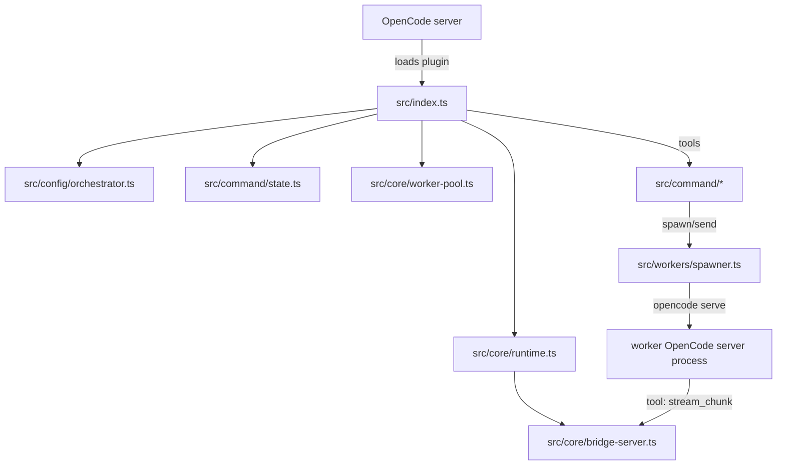
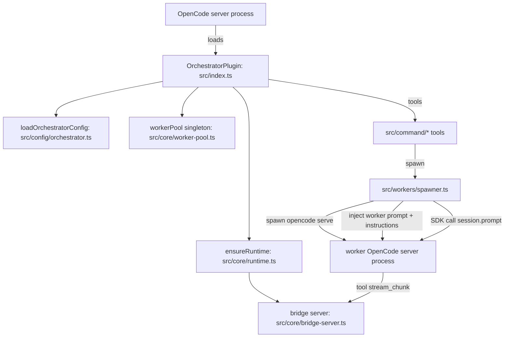

# Refactory (production blueprint + adversarial repo review)

This file is the **shared context** to attach when executing any single task in `tasks/task-XX.md`.
It answers:
1) what the repo is *today* (wiring + sources of truth)
2) what it should become (clean, minimal, OpenCode-aligned)
3) where each concept lives (skills vs agents vs orchestrator profiles)
4) what rules must not be broken (stability, tests, boundaries)

This is still deliberately critical (“red team”) because the goal is to regain a clean mental map **without destabilizing** what already works.

---

## How to use this doc (workflow)

When you work a task:

1. Open `refactory.md` (this file).
2. Open exactly one task file: `tasks/task-01.md`, `tasks/task-02.md`, …
3. Execute the task’s checklist, keeping `bun run check` green (once it exists).
4. If you must deviate, update the task file (or add an “amendment” section) so the next person/model can follow.

---

## Production standards (enforced)

These are the repo’s standards. If a task violates these, it is not complete even if it “works”.

### Stability-first

- Refactors must be behavior-preserving unless the behavior change is explicitly described and tested.
- Prefer compatibility layers + incremental migration over rewrites.
- Every step must be reversible (rollback plan documented in the task).

### OpenCode alignment (naming + formats)

We build on:
- Plugins: `https://opencode.ai/docs/plugins/`
- Agents: `https://opencode.ai/docs/agents/`
- Skills: `https://opencode.ai/docs/skills/`
- Permissions: `https://opencode.ai/docs/permissions/`
- SDK TUI: `https://opencode.ai/docs/sdk/#tui`

Hard constraints from the OpenCode docs:
- **OpenCode skills** live at `.opencode/skill/<name>/SKILL.md` and the frontmatter recognizes only: `name`, `description`, `license`, `compatibility`, `metadata` (unknown fields are ignored).
- **OpenCode agents** can be configured via markdown at `.opencode/agent/<name>.md` (frontmatter: `description`, `mode`, `model`, `temperature`, `tools`, `permission`, …).
- **SDK TUI** has an explicit API surface (eg. `tui.openHelp`, `tui.openModels`, `tui.appendPrompt`, `tui.executeCommand`, `tui.showToast`).

Repo rule: **do not use “skill” to mean “agent profile”.** If it configures model/tools/permissions, it’s an agent/profile, not an OpenCode skill.

### Minimalism and boundaries

- One source of truth per concept (see table below).
- Avoid parallel “stacks” that do the same job (eg. OpenCode events *and* a separate SSE API, unless one is transitional and scheduled for deletion).
- Fewer layers beats clever abstractions.

### Production checks

Each task completes only when:

- lint passes
- typecheck passes
- tests pass
- build passes

Task 01 establishes a single `bun run check` gate (currently the repo does not have a real lint gate).

---

## Repo map (current, as-is)

High-level tree (hand-curated; excludes `node_modules/` and build outputs):

```txt
.
├─ src/                  # orchestrator plugin runtime (publishable today)
├─ schema/               # orchestrator config schema (JSON Schema)
├─ bin/                  # runtime helper plugin (worker bridge)
├─ prompts/              # orchestrator prompt (TS file)
├─ test/                 # plugin tests (unit/integration/e2e mixed)
├─ docs/                 # plugin docs (architecture/guide/config)
├─ app/                  # control panel (Solid) (not wired cleanly today)
├─ desktop/              # Tauri desktop wrapper
├─ orchestra/            # example OpenCode project + skill/agent files (+ coverage output)
├─ .opencode/            # OpenCode runtime state (currently tracked; should not be)
└─ tasks/                # refactor tasks (task-01..task-10 + final-task)
```

### What is “real” runtime vs “repository noise”

- **Real runtime**: `src/` + `bin/` + `schema/` + `prompts/` (the plugin), plus OpenCode itself.
- **Secondary product**: `app/` + `desktop/` (UX layer, currently partially disconnected from plugin runtime).
- **Noise / confusion multipliers**:
  - `.opencode/` (runtime DB and attachments are currently committed)
  - `orchestra/` (example project + non-standard “skills” frontmatter + coverage output)

---

## Target repo map (production monorepo)

This is the intended “mental model tree” after Tasks 01–03:

```txt
.
├─ packages/
│  └─ orchestrator/            # the publishable OpenCode plugin
│     ├─ src/
│     ├─ schema/
│     ├─ prompts/
│     ├─ bin/
│     └─ test/
├─ apps/
│  ├─ control-panel/           # the UI (web)
│  └─ desktop/                 # Tauri wrapper
├─ examples/
│  └─ orchestra/               # example OpenCode project config (sanitized)
├─ docs/                       # workspace/product docs
├─ tasks/                      # this plan
└─ refactory.md                # shared context
```

### Path mapping (current → target)

| Current path | Target path | Why |
|---|---|---|
| `src/` | `packages/orchestrator/src/` | isolate publishable plugin |
| `schema/` | `packages/orchestrator/schema/` | keep schema with the plugin |
| `bin/` | `packages/orchestrator/bin/` | runtime helper belongs to plugin |
| `prompts/` | `packages/orchestrator/prompts/` | prompts are plugin assets |
| `test/` | `packages/orchestrator/test/` | tests belong to plugin package |
| `app/` | `apps/control-panel/` | “app” is product UI |
| `desktop/` | `apps/desktop/` | desktop is product UI |
| `orchestra/` | `examples/orchestra/` | keep only sanitized example config |
| `.opencode/` | *(ignored, runtime state)* | never commit runtime DB/attachments |

---

## Glossary + sources of truth (the “no more layers” table)

This table is the core of un-confusing the repo.

| Concept | What it is | OpenCode standard? | Source of truth (target) | What we do today (problem) |
|---|---|---:|---|---|
| **Plugin** | Extends OpenCode via hooks + tools | ✅ | `packages/orchestrator/src/index.ts` | ok (`src/index.ts`) |
| **Agent** | Named assistant with model/tools/permissions | ✅ | `.opencode/agent/<name>.md` or `opencode.json` | mixed; “subagents” stored as `SKILL.md` in `orchestra/.opencode/agent/subagents/*` |
| **Skill** | Reusable instruction pack loaded via `skill()` | ✅ | `.opencode/skill/<name>/SKILL.md` | `orchestra/.opencode/skill/*/SKILL.md` includes ignored extra fields (ghost config) |
| **Worker profile** | Orchestrator-owned worker definition for routing/spawning | ❌ (plugin-specific) | `orchestrator.json` (plugin schema) | exists + overlaps with UI “skills” |
| **Workflow** | Multi-step plan the orchestrator can run | ❌ (plugin-specific) | `orchestrator.json` + plugin runtime | partially implemented; not the single primitive |
| **Memory** | Persistent knowledge store + injection | ❌ (plugin-specific) | workflow + memory tools + optional DB | auto-record exists; missing “memory agent handshake” |

---

## The unifying model (where the “magic” should happen)

This section captures the **desired conceptual model** you described. It is the design we should optimize the codebase around.

### 1) Skills (Anthropic-style; OpenCode-discoverable)

**Definition (our intent):**
- A **skill** is a self-contained folder of instructions + resources.
- It teaches an agent how to do a repeatable task and how to use a specific tool/integration.

**Reference pattern (Anthropic-style skills):**
- The widely-used “skills” folder convention is `SKILL.md` plus optional `references/`, `scripts/`, and `assets/`.
- We should keep our skill folders compatible with that convention so we can reuse/port skill packs with minimal changes (example reference repo: `https://github.com/anthropics/skills`).

**OpenCode constraint (must respect):**
- OpenCode discovers skills via `.opencode/skill/<name>/SKILL.md` (and equivalents).
- OpenCode skill frontmatter recognizes only `name`, `description`, `license`, `compatibility`, `metadata` (unknown fields are ignored).

**How we model “tools/integrations associated with a skill” (OpenCode-compatible):**
- Put the “how to use the tool/integration” guidance in `SKILL.md` body text.
- Put additional references under the skill folder (Anthropic-compatible pattern):
  - `references/` (docs, API notes, examples)
  - `scripts/` (optional helper scripts the agent can run via `bash` if permitted)
  - `assets/` (images/templates/fixtures)
- Optionally use `metadata` (string→string) to *declare* required tools/integrations, eg:
  - `metadata: { integration: "linear", tools: "mcp:linear" }`
  This is **not enforced by OpenCode** by default, but it gives us something the orchestrator can parse later if we choose.

### 2) Agents / subagents (OpenCode standard)

**Definition:**
- An **agent** is an OpenCode-configured assistant with a model, temperature, tools, permissions, and a prompt.
- A **subagent** is an agent with `mode: subagent` that can be invoked by `@mention` or programmatically (by setting `SessionPromptData.body.agent`).

**How agents connect to skills:**
- Agents/subagents should have `tools.skill: true` (and appropriate `permission.skill` patterns).
- Their prompt should instruct *when* to load which skills.
- The agent can call `skill({ name })` to load the skill’s instructions, then use file/bash/tools as permitted to execute it.

### 3) Independent OpenCode servers (spawned worker processes)

**Definition:**
- A spawned `opencode serve` process is an **independent runtime** with its own session history + context that stays live until stopped.

**When to use:**
- Long-running specialists that need durable context isolation.
- Parallelism without contending for the orchestrator session.
- When we need capabilities that are easier to encapsulate as a separate OpenCode instance (eg. vision as a separate model).

**Current implementation seam (today):**
- Spawn path: `src/workers/spawner.ts:318` (starts `opencode serve` and connects via SDK client)
- Worker recursion guard: `src/workers/spawner.ts:201` sets `OPENCODE_ORCHESTRATOR_WORKER=1`

### 4) Tools and integrations

**Definition:**
- “Tools/integrations” are how the system touches the outside world (MCP servers, APIs like Linear, DBs, file system).

**Ideal packaging:**
- Tools/integrations should “break into skills”:
  - The integration’s usage playbook lives in a skill folder.
  - The runtime access is provided by OpenCode tools / MCP / plugin tools.
  - The worker that uses it is configured to allow only what it needs.

---

## Workers (plugin-level standard; compiled down to OpenCode concepts)

This is our **customizable unit** that bundles model/prompt/skills/spawn type. It must “trickle down” into OpenCode-native constructs.

### Worker bundle (target definition)

A worker should bundle:

1) **Model & provider configuration**
2) **System prompt** (prefer file-based prompts; Task 04)
3) **Spawn type**
   - `agent` (OpenCode agent; usually `mode: primary`)
   - `subagent` (OpenCode agent; `mode: subagent`)
   - `server` (independent `opencode serve` process)
   - Note: `agent` vs `subagent` is primarily an OpenCode **agent mode** distinction; both run via the same “agent backend” API. The only truly different runtime is `server`.
4) **Skills directory**
   - OpenCode/Anthropic-compatible folder structure: `.opencode/skill/<name>/SKILL.md` + optional `references/`, `scripts/`, `assets/`
5) **Tools/integrations policy**
   - OpenCode agent `tools` + `permission` are the primary enforcement mechanism.
   - (Optional later) plugin can hard-enforce via hook `tool.execute.before` if we need guardrails beyond OpenCode config.

### How this “trickles down” (compilation model)

Given a worker definition, the orchestrator should be able to:

- If `spawnType` is `agent`/`subagent`:
  - inject an OpenCode agent definition (either in `opencodeConfig.agent` via plugin `config` hook, or via `.opencode/agent/<name>.md` files)
  - set `model`, `temperature`, `tools`, and `permission` accordingly
  - ensure the agent can load skills (if intended) by enabling `tools.skill` + configuring `permission.skill`

- If `spawnType` is `server`:
  - spawn `opencode serve` (existing code path)
  - connect with an SDK client
  - keep per-worker session history in that server (not in orchestrator session)
  - stream output via the bridge/event plane (Task 08)

This is the “most important thing”: plugin config must compile to **OpenCode-compatible** agents/skills/permissions rather than inventing competing formats.

### Worker → OpenCode mapping (explicit, field-by-field)

This is the concrete bridge between “our worker standard” and OpenCode’s primitives.

| Worker bundle piece (our language) | OpenCode primitive (what it becomes) | Source of truth (target) | Notes |
|---|---|---|---|
| `workerId` | agent name / spawn target | `.opencode/agent/<workerId>.md` | stable ID across UI/config/runtime |
| model + provider | `agent.model` (provider/model) | `.opencode/agent/<workerId>.md` (frontmatter) | OpenCode resolves provider config |
| system prompt | `agent.prompt` | `.opencode/agent/<workerId>.md` body *(or prompt file)* | keep prompt content out of TS strings |
| spawn type | agent `mode` **or** plugin spawn backend | `.opencode/agent/<workerId>.md` (`mode`) + `.opencode/orchestrator.json` (backend) | `mode: primary|subagent`; backend: `agent|server` |
| skills directory | `skill()` tool reads `.opencode/skill/*` | `.opencode/skill/<name>/SKILL.md` (+ resources) | skills stay “just skills” (instruction packs) |
| tool/integration policy | `tools.*` + `permission.*` | `.opencode/agent/<workerId>.md` frontmatter | enforce least-privilege per worker |
| integrations (Linear/DB/MCP/etc.) | OpenCode tools / MCP servers / plugin tools | OpenCode config + plugin tool surface | skill docs teach usage; config grants access |

### Golden path example (target end-state)

This is what “clean + OpenCode-aligned” looks like in a user project (and in `examples/orchestra/`).

```txt
examples/orchestra/
  .opencode/
    orchestrator.json            # plugin config (workers/workflows/triggers)
    agent/
      orchestrator.md            # primary agent (workflow brain)
      memory.md                  # subagent (memory handshake)
      vision.md                  # subagent (vision fallback)
    skill/
      linear/
        SKILL.md
        references/
          api.md
      memory/
        SKILL.md
      vision/
        SKILL.md
```

And the conceptual “compilation” is:

```mermaid
flowchart LR
  OCFG[.opencode/orchestrator.json\n(plugin-owned)] -->|selects backend + worker IDs| ORCH[orchestrator runtime]
  ORCH -->|invokes agent backend| OCAG[OpenCode agents\n.opencode/agent/*.md]
  ORCH -->|invokes server backend| OCSV[opencode serve worker process]
  OCAG -->|may load| OCSK[OpenCode skills\n.opencode/skill/*/SKILL.md]
  OCAG -->|uses| TOOLS[Tools & integrations\n(MCP + plugin tools)]
```

---

## Workflows (orchestrator instruction manual)

Workflows are the orchestrator’s programmable “instruction manual” that:

- spawns workers (sync or async)
- chooses the correct spawn type per worker (agent/subagent/server)
- passes the right context and constraints
- receives back only the deliberate “result payload” (tool response/report), not uncontrolled full context dumps

In other words: workflows are how the orchestrator stays the “high-level brain” while workers do scoped work.

---

## Defaults we ship (three preconfigured workers)

These are the initial “golden path” workers we should ship and document clearly. Everything else is user-extensible.

### 1) `orchestrator` (primary agent)

- Role: manages workflows, workers, spawns, and configuration.
- Constraints:
  - should not use raw filesystem/bash tools unless explicitly permitted; it delegates work.
- Implementation anchor today:
  - injected agent config: `src/index.ts:216`
  - orchestrator prompt text: `prompts/orchestrator.ts:8`

### 2) `memory` (subagent or server-backed specialist)

- Role: durable memory via Neo4j + SQLite + a gitignored memory directory.
- Integrations: eg. Linear (as a skill + allowed tool/integration).
- Required behavior (target):
  - orchestrator sends a bounded “turn summary”
  - memory enriches and writes
  - memory explicitly acks completion (so it’s observable)
- Current partial implementation:
  - Neo4j-backed auto-record: `src/index.ts:459` → `src/memory/auto.ts:1`

### 3) `vision` (subagent or server-backed specialist)

- Role: when the active model cannot see images, vision worker handles image analysis.
- Current behavior:
  - asynchronous vision analysis scheduling + wakeup injection: `src/index.ts:330` and `src/index.ts:419`

---

## Context index (where to look for what)

Use this when you’re lost. It’s the “jump table” for the repo.

| If you need… | Start here | Notes |
|---|---|---|
| Plugin entry + OpenCode hook wiring | `src/index.ts:34` | config injection, vision/memory automation |
| Orchestrator config parsing + defaults | `src/config/orchestrator.ts:66` | schema owner for plugin behavior |
| Built-in worker profiles (and their prompts today) | `src/config/profiles.ts:10` | prompts should move to files (Task 04) |
| Orchestrator tools exposed to OpenCode | `src/command/index.ts:108` | `coreOrchestratorTools` + `pluginTools` |
| Global mutable state used by tools | `src/command/state.ts:11` | refactor target (Task 06) |
| Worker spawning + worker messaging | `src/workers/spawner.ts:318` | stability-critical, high complexity |
| Worker output extraction + attachments | `src/workers/prompt.ts` | used by E2E tests |
| Worker pooling + cross-session reuse | `src/core/worker-pool.ts:187` | device registry + in-flight spawn dedupe |
| Streaming transport (SSE) | `src/core/bridge-server.ts:47` | likely evolves into orchestrator event stream (Task 08) |
| Workflow engine | `src/workflows/engine.ts:1` | should become the core primitive (Task 07) |
| Memory graph + injection | `src/memory/auto.ts:1`, `src/memory/inject.ts:1` | move towards memory agent handshake (Task 07) |
| App ↔ OpenCode connection | `app/src/context/opencode.tsx:38` | `/event` subscription and polling |
| App’s “orchestra.event” expectations | `app/src/context/opencode-helpers.ts:119` | currently mismatched with plugin |
| Desktop sidecar spawn + plugin injection | `desktop/src-tauri/src/lib.rs:177` | fix plugin discovery + wiring (Task 10) |

---

## The key wiring today (what plugs into what)

### Orchestrator plugin runtime (today)

Entry + major behaviors:
- Plugin entry: `src/index.ts:34`
- Loads config: `src/config/orchestrator.ts:282`
- Injects orchestrator agent + commands into OpenCode config: `src/index.ts:174`
- Auto vision analysis hook: `src/index.ts:330`
- Auto memory record: `src/index.ts:444`
- System injection: memory + worker summary: `src/index.ts:302`

Tool surface:
- Tools are composed in `src/command/index.ts:108` (core) and `src/command/index.ts:139` (plugin/UX/config/memory).

Streaming:
- Worker servers stream chunks to the bridge server: `src/core/bridge-server.ts:47` (endpoints `/v1/stream/chunk` and `/v1/stream`).
- Spawner wires bridge tool IDs and worker bridge plugin: `src/workers/spawner.ts:48` and tool check at `src/workers/spawner.ts:164`.



### Control panel app runtime (today)

- OpenCode API: `app/src/context/opencode.tsx:40` connects to `http://localhost:4096` by default.
- Subscribes to OpenCode events: `app/src/context/opencode.tsx:84` and calls `actions.handleOrchestraEvent(event)` at `app/src/context/opencode.tsx:96`.
- Parses “orchestra.event”: `app/src/context/opencode-helpers.ts:119` et al.

Problem: the plugin does not clearly publish `orchestra.event` into OpenCode’s `/event` stream today, so the UI is not observing the true plugin runtime.

### Desktop runtime (today)

- Desktop spawns `opencode serve` sidecar and injects a plugin URL: `desktop/src-tauri/src/lib.rs:139`.
- Plugin discovery searches for `orchestra/dist/index.js`: `desktop/src-tauri/src/lib.rs:124` (this is likely wrong for this repo layout).
- Desktop and app both assume a “skills API” on port 4097: `desktop/src-tauri/src/lib.rs:26` and `app/src/lib/opencode-base.ts:43`.

Problem: the “skills API” server does not live in the plugin, so it is an extra moving part and a source of confusion.

---

## Target wiring (what plugs into what, after refactor)

This is the intended end-state wiring once the tasks are complete. It’s the “single mental map” the UI and docs should teach.

Key design choices:
- **Workers run as OpenCode agents/subagents by default** (no extra OpenCode server processes), with a legacy `backend: "server"` path only if needed.
- **Skills are only skills** (instruction packs loaded via `skill({ name })`); they do not carry model/tools/permissions config.
- **Workflows are the orchestrator primitive**, including “automatic workflows” like vision analysis and memory enrichment.
- **One observability plane** for the app/desktop: a single orchestrator event stream with a versioned schema.

```mermaid
flowchart TD
  OC[OpenCode server] -->|loads| OP[Orchestrator plugin]

  OP --> CFG[orchestrator.json]
  OP --> WF[Workflow engine]
  OP --> EVT[Orchestrator event stream]

  OP -->|defines| OA[orchestrator agent (primary)]
  OC -->|invokes| OA

  OA -->|delegates via agent backend| SA[subagents: vision/docs/coder/memory/...]
  SA -->|may load| SK[OpenCode skills: .opencode/skill/*/SKILL.md]

  WF -->|triggers| VWF[vision workflow]
  WF -->|triggers| MWF[memory workflow]

  APP[control panel] -->|OpenCode: sessions/messages| OC
  APP -->|orchestrator: workers/workflows/memory| EVT

  DESKTOP[Tauri shell] -->|spawns sidecar| OC
  DESKTOP -->|hosts| APP
```

Practical implication: the “skills API on 4097” should either be deleted or re-scoped into the orchestrator’s event/config API so the user has **one** place to look.

---

## Ports, endpoints, and implicit contracts (today)

| Component | Default | Where referenced | Notes |
|---|---:|---|---|
| OpenCode server | `4096` | `app/src/context/opencode.tsx:41` | UI connects here |
| Skills API | `4097` | `desktop/src-tauri/src/lib.rs:26` | unclear ownership (not plugin) |
| Orchestrator worker base port | `14096` | `src/config/orchestrator.ts:287` | workers may use basePort 0 in tests |
| Bridge server | ephemeral | `src/core/bridge-server.ts:47` | auth token required today |

Bridge server endpoints:
- `POST /v1/stream/chunk` (worker writes, token required): `src/core/bridge-server.ts:55`
- `GET /v1/stream` (read SSE, token required): `src/core/bridge-server.ts:87`

---

## SDK TUI (how we should simplify UX)

The orchestrator already uses `tui.showToast` (example: `src/index.ts:65`, `src/command/ux.ts:52`).
To make UX simple and consistent, we should standardize a small set of TUI interactions:

- First-run onboarding: `tui.openHelp()` and `tui.openModels()` when no working model exists.
- Progressive hints: `tui.appendPrompt({ text })` to seed the user’s prompt with the next good command.
- Clear state transitions: `tui.showToast({ message, variant })` for “worker spawned/failed”, “workflow started/completed”, “memory saved”.

Reference: OpenCode SDK TUI methods are documented at `https://opencode.ai/docs/sdk/#tui`.

---

## CI reality check (today)

CI config: `.github/workflows/ci.yml:1`

Issue: the test job references missing tests:
- `.github/workflows/ci.yml:47` includes `test/orchestrator.test.ts`, `test/profile-lock.test.ts`, `test/registry-ownership.test.ts` which do not exist in this repo.

Task 01 fixes the gate; Task 03 tiers tests so CI is deterministic.

---

## Task roadmap index (what changes, in order)

These tasks exist in `tasks/`. Each task must end with lint + typecheck + tests + build passing.

| Task | Theme | Structural impact | Key dependencies |
|---:|---|---|---|
| 01 | standards + `check` gate + CI test audit | low | none |
| 02 | real workspace (monorepo) + delete tracked runtime artifacts | high | 01 |
| 03 | test tiering + CI hardening | medium | 02 (recommended), works on root too |
| 04 | prompts + permissions clarity + TUI affordances | medium | 02 |
| 05 | workers as configurable backend (agent vs server) | high | 03, 04 |
| 06 | orchestrator modularity (kill globals, split god modules) | high | 05 (helps), tests must be strong |
| 07 | workflows as primitive + memory + vision automation | high | 05, 06 |
| 08 | observability + event contract plugin↔app↔desktop | high | 02, 07 |
| 09 | app UX + Warm Paper design + show system | medium | 08 |
| 10 | desktop UX + onboarding + one-command dev | medium | 02, 08, 09 |
| final | coherence + minimalism + LOC direction | medium | 01–10 |

---

## Risk register (stability threats to watch)

1) **Worker spawning is stability-critical**: `src/workers/spawner.ts:318` and `src/core/worker-pool.ts:215`.
2) **Hidden global state** makes refactors dangerous: `src/command/state.ts:11`.
3) **UI event expectations don’t match plugin reality**: `app/src/context/opencode.tsx:96` + `app/src/context/opencode-helpers.ts:119`.
4) **Runtime artifacts committed**: `.opencode/user.db*` and attachments should be removed from git and ignored.
5) **Version skew** across `@opencode-ai/*` dependencies: `package.json:31` vs `app/package.json:19` and `desktop/package.json:15`.

---

## Adversarial repo review (original)

## Scope (what I reviewed)

I reviewed the source + configs in:
- `src/` (orchestrator plugin runtime)
- `schema/`, `docs/`, `prompts/`, `test/`, `scripts/`, `bin/`
- `app/` (Solid UI)
- `desktop/` (Tauri wrapper)
- `.opencode/` (tracked dev config + untracked runtime artifacts)
- `orchestra/` (local OpenCode project + skills + configs in `.opencode/`)

I did **not** inspect `node_modules/`, `dist/`, large binaries, or local DB contents (`.opencode/user.db*`) beyond file presence, because those are either generated or potentially sensitive.

## “Why is my mental map broken?” (objective snapshot)

Ignoring `node_modules/` and `dist/`, the repo is roughly:
- `app/`: ~14k LOC (UI dominates the repo)
- `src/`: ~10.5k LOC (the actual plugin)
- `test/`: ~6.5k LOC
- `docs/`: ~2.6k LOC
- `desktop/`: ~1.2k LOC

Largest “complexity hotspots” by file size:
- `src/workers/spawner.ts` (~1000 LOC): spawn + prompt building + attachment normalization + response extraction + partial streaming handling
- `src/core/worker-pool.ts` (~680 LOC): registry + cross-session persistence + dedupe + ownership
- `src/index.ts` (~500 LOC): plugin init + OpenCode config injection + multiple hook behaviors (passthrough, vision routing, memory)
- `app/` adds a full UI + a separate “skills + db” API client layer (port `4097`), which is conceptually *not* part of an “orchestrator plugin” package.

Net: this repo currently contains **at least three distinct products** with different lifecycles and standards:
1) the orchestrator plugin (`opencode-orchestrator`)
2) the OpenCode UI (`@opencode-ai/app`) + desktop wrapper (`@opencode-ai/desktop`)
3) a local OpenCode project (`orchestra/`) with `.opencode/skill/*/SKILL.md` content and its own `.opencode/orchestrator.json`

## The core confusion: “skill” vs “profile” vs “agent”

Right now, the repo mixes three *different* concepts under overlapping names.

### OpenCode plugin standard (baseline)
From OpenCode’s plugin docs (`plugins.mdx`), a plugin is a JS/TS module exporting plugin functions that return hook implementations. Your plugin (`src/index.ts`) is aligned with this.

### OpenCode skill standard (baseline)
From OpenCode’s skill docs (`skills.mdx`):
- skills live at `.opencode/skill/<name>/SKILL.md` (or global equivalents)
- `SKILL.md` frontmatter officially recognizes **only**: `name`, `description`, `license`, `compatibility`, `metadata`
- any other frontmatter fields are ignored by OpenCode

### Orchestrator “worker profiles” (this repo)
In the plugin code, the real “worker definition” is `WorkerProfile` (`src/types/index.ts`) and the real config is `.opencode/orchestrator.json` / `~/.config/opencode/orchestrator.json` parsed by `src/config/orchestrator.ts`.

### UI “skills” (this repo)
In the UI, `SkillFrontmatter` (`app/src/types/skill.ts`) includes fields like `model`, `temperature`, `tools`, `permissions`, `supportsVision`, etc. That is **not** an OpenCode “skill” per the docs; it’s an **agent/profile configuration** format.

### The result (adversarial take)
You currently have *multiple overlapping sources of truth* for “what a worker/agent is”:
- plugin built-ins (`src/config/profiles.ts`)
- orchestrator config profiles (`.opencode/orchestrator.json`)
- UI “skills” (`app/src/types/skill.ts` + `/api/skills`)
- OpenCode skills in `orchestra/.opencode/skill/*/SKILL.md` (with non-standard frontmatter fields like `model`, `tools`, `sessionMode`, etc, which OpenCode will ignore)

This is the main reason the system feels like it has “many layers”: it literally does.

## Current runtime architecture (what actually runs)

### Orchestrator plugin runtime (what is real + stable)

High-level flow (simplified):



Key stability anchors worth preserving:
- Strong integration/e2e tests around spawning, bridge server, workflows: `test/*`
- Defensive recursion prevention: `OPENCODE_ORCHESTRATOR_WORKER=1` in `src/index.ts` / `src/workers/spawner.ts`
- Best-effort cleanup and cross-session reuse: `src/core/runtime.ts`, `src/core/worker-pool.ts`

### UI runtime (what looks disconnected today)

The UI is wired to:
- OpenCode server at `http://localhost:4096` (`app/src/context/opencode.tsx`)
- a **separate** “skills API” at `http://localhost:4097` (`app/src/context/skills.tsx`, `app/src/context/db.tsx`)

The UI also expects OpenCode events of type `orchestra.event` (see `app/src/context/opencode-helpers.ts`) — but there is **no** corresponding event emission in the plugin code under `src/`.

Adversarial conclusion: as checked in, `app/` is not clearly a frontend for the plugin in `src/`; it’s either incomplete integration or it belongs to a different system.

## Quality review (adversarial but fair)

### What’s strong (keep it)
- **Test discipline**: real e2e spawn tests (`test/e2e*.ts`) and integration tests (`test/integration/bridge-server.test.ts`) are doing heavy stability work.
- **Hardening against real-world failure**: worker reuse + orphan cleanup is thoughtful and pragmatic (`src/core/runtime.ts`, `src/core/worker-pool.ts`).
- **Separation by folders** in `src/` is generally good: `config/`, `core/`, `workers/`, `ux/`, `memory/`, `workflows/`.

### What is actively harming maintainability

1) **Multiple competing “sources of truth” for agent/worker definitions**
   - Same concepts exist in multiple formats (WorkerProfile, UI Skill, OpenCode SKILL.md, orchestrator.json, plus a second orchestrator.json in `orchestra/` with extra fields).
   - This guarantees confusion: you can’t know which layer is authoritative without tracing code paths.

2) **Name collisions with OpenCode standards**
   - Using “skills” for things that look like “agent profiles” violates the OpenCode mental model from `skills.mdx`.
   - Worse: `orchestra/.opencode/skill/*/SKILL.md` includes fields that OpenCode explicitly ignores. If you believe those fields affect runtime, you are debugging a ghost.

3) **Repo-level product mixing without a clear workspace boundary**
   - `desktop/package.json` depends on `@opencode-ai/app` via `workspace:*`, but the repo root does not declare a workspace. That’s a structural smell.
   - `app/` includes both `bun.lock` and `package-lock.json` (lockfile split-brain).
   - Versions diverge: root plugin depends on `@opencode-ai/*` `^1.0.164` while `app/` and `desktop/` are `1.0.203`.

4) **Large “god modules” in the plugin**
   - `src/index.ts` is doing plugin init *and* multi-hook behavior orchestration (passthrough + vision + memory + config injection + session cleanup).
   - `src/workers/spawner.ts` mixes: spawn lifecycle, worker config composition, attachment normalization, prompt crafting, response extraction, fallback polling.
   - `src/core/worker-pool.ts` is a deliberate consolidation (per changelog) but it’s now a very dense abstraction.

5) **Dead/unused code paths increasing cognitive load**
   - `src/command/main.ts` is not referenced anywhere (and pulls in `src/core/net-utils.ts`, `src/core/system-optimizer.ts`, `src/core/file-monitor.ts`, which are also unused elsewhere).
   - Keeping large unused modules around is a classic “it still works, but it’s harder to reason about” trap.

6) **Working-tree noise / config sprawl**
   - `.opencode/orchestrator.json` is tracked, but `.opencode/user.db*`, `.opencode/attachments/`, `.opencode/vision/` are not ignored → constant untracked churn.
   - `orchestra/` appears to be a local project environment inside the repo root, not a published artifact, but it materially increases the mental surface area.

## Refactor goals (stability-first)

If stability is the priority, the refactor should optimize for:
- **One source of truth per concept** (workers/profiles vs OpenCode skills vs OpenCode agents)
- **Explicit boundaries** between products (plugin vs UI vs local playground)
- **Reduction of implicit global state** (fewer singletons / “setX() then rely everywhere”)
- **Version coherence** (one `@opencode-ai/*` version band across packages)
- **Incremental change strategy** (compat layers + tests stay green)

## Concrete, low-risk path forward (phased)

### Phase 0 (lowest risk): clarify naming + sources of truth
Deliverable: the repo becomes explainable in 5 minutes.
- Add a “glossary + source-of-truth table” to `README.md` or `docs/architecture.md`.
- Rename UI concepts to match reality:
  - If `app/` is editing **agent profiles**, stop calling them “skills” internally (types, API routes, UI strings).
  - If they truly are OpenCode skills, remove unsupported frontmatter fields and keep them compliant with `skills.mdx`.
- Decide which file owns worker definitions:
  - recommend: **`orchestrator.json` owns worker profiles**; OpenCode `SKILL.md` owns reusable instructions only.

### Phase 1 (low–medium risk): split the repo into explicit workspaces or separate repos
Pick one:
- **Option A (minimalism): split into repos**
  - repo 1: plugin (`opencode-orchestrator`) = current `src/`, `schema/`, `docs/`, `test/`, `bin/`
  - repo 2: UI/desktop (`@opencode-ai/app`, `@opencode-ai/desktop`)
  - keep `orchestra/` out of either repo (it’s a local playground)
- **Option B (monorepo): formalize a workspace**
  - add root workspace config (Bun workspaces, or pnpm, etc)
  - move to `packages/orchestrator-plugin`, `apps/web`, `apps/desktop`
  - delete `app/package-lock.json` and standardize on one lockfile strategy
  - align all `@opencode-ai/*` versions

This alone will shrink the “mental active set” dramatically.

### Phase 2 (medium risk): de-tangle plugin internals without behavior changes
Strategy: refactor behind stable interfaces and keep the tests.
- Replace `src/command/state.ts` global mutable context with an explicit `OrchestratorContext` object created in `src/index.ts` and injected into tool factories.
  - Keep current exports as thin adapters for compatibility at first.
- Split `src/workers/spawner.ts` into:
  - `spawn-opencode.ts` (process spawn + readiness)
  - `worker-prompt.ts` (initial system prompt + instructions)
  - `attachments.ts` (normalize/prepare attachments)
  - `prompt-response.ts` (extract text + fallback polling)
  - `send.ts` (sendToWorker)
- Keep `src/core/worker-pool.ts` as-is for now; it’s stability-critical. Only split once everything else is clearer.

### Phase 3 (medium–high risk): reconcile “skills ↔ profiles ↔ agents”
This is where the big simplification happens, but only after Phase 0–2.

Recommended “clean model”:
- **Profiles** (orchestrator concern): live in `orchestrator.json` and drive worker spawning.
- **Agents** (OpenCode concern): live in `opencode.json` or `.opencode/agent/*.md`.
- **Skills** (OpenCode concern): live in `.opencode/skill/*/SKILL.md` and are reusable instruction packs only.

If you want a worker to “have a skill”, that should be:
- a runtime action (call `skill({ name })`) or
- an agent prompt composition decision
…not “bake random extra frontmatter into SKILL.md and hope it changes runtime”.

### Phase 4 (high risk): make the UI actually reflect plugin runtime (if that’s the goal)
Right now the UI expects `orchestra.event` events that the plugin doesn’t emit.
Pick a contract:
- Either: the plugin emits OpenCode events in a documented schema
- Or: the UI connects directly to the orchestrator bridge server (`src/core/bridge-server.ts`) and consumes its SSE stream

Then implement exactly one path and delete the other.

## Quick wins (safe, immediate payoff)

These don’t change runtime behavior but reduce confusion:
- Remove or quarantine unused modules (`src/command/main.ts`, and its dependent unused `src/core/*` helpers) into an `experimental/` directory or delete them if truly dead.
- Standardize lockfiles (Bun vs npm) and align `@opencode-ai/*` versions.
- Tighten ignores for runtime artifacts under `.opencode/` (DBs, attachments, logs) so they don’t constantly appear as untracked.
- Either track `orchestra/` as an intentional example (`examples/orchestra/`) or move it out of the repo.

## The single most important decision

Decide what this repo *is*:
- **A plugin repo** (minimal surface area, stable, shippable), or
- **A monorepo for plugin + app + desktop + example project**

Both can work, but the current “half-monorepo” state is the worst of both worlds.

If you tell me which direction you want (plugin-only vs monorepo), I can turn this into a concrete, step-by-step refactor PR sequence that keeps `bun test` green the whole time.
