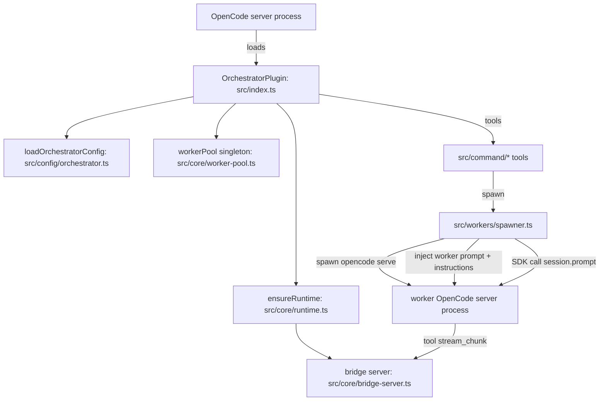

# Refactory (adversarial repo review)

This is a deliberately critical (“red team”) review of the current repo, with the goal of regaining a clean mental map **without destabilizing** what already works.

## Scope (what I reviewed)

I reviewed the source + configs in:
- `src/` (orchestrator plugin runtime)
- `schema/`, `docs/`, `prompts/`, `test/`, `scripts/`, `bin/`
- `app/` (Solid UI)
- `desktop/` (Tauri wrapper)
- `.opencode/` (tracked dev config + untracked runtime artifacts)
- `orchestra/` (local OpenCode project + skills + configs in `.opencode/`)

I did **not** inspect `node_modules/`, `dist/`, large binaries, or local DB contents (`.opencode/user.db*`) beyond file presence, because those are either generated or potentially sensitive.

## “Why is my mental map broken?” (objective snapshot)

Ignoring `node_modules/` and `dist/`, the repo is roughly:
- `app/`: ~14k LOC (UI dominates the repo)
- `src/`: ~10.5k LOC (the actual plugin)
- `test/`: ~6.5k LOC
- `docs/`: ~2.6k LOC
- `desktop/`: ~1.2k LOC

Largest “complexity hotspots” by file size:
- `src/workers/spawner.ts` (~1000 LOC): spawn + prompt building + attachment normalization + response extraction + partial streaming handling
- `src/core/worker-pool.ts` (~680 LOC): registry + cross-session persistence + dedupe + ownership
- `src/index.ts` (~500 LOC): plugin init + OpenCode config injection + multiple hook behaviors (passthrough, vision routing, memory)
- `app/` adds a full UI + a separate “skills + db” API client layer (port `4097`), which is conceptually *not* part of an “orchestrator plugin” package.

Net: this repo currently contains **at least three distinct products** with different lifecycles and standards:
1) the orchestrator plugin (`opencode-orchestrator`)
2) the OpenCode UI (`@opencode-ai/app`) + desktop wrapper (`@opencode-ai/desktop`)
3) a local OpenCode project (`orchestra/`) with `.opencode/skill/*/SKILL.md` content and its own `.opencode/orchestrator.json`

## The core confusion: “skill” vs “profile” vs “agent”

Right now, the repo mixes three *different* concepts under overlapping names.

### OpenCode plugin standard (baseline)
From OpenCode’s plugin docs (`plugins.mdx`), a plugin is a JS/TS module exporting plugin functions that return hook implementations. Your plugin (`src/index.ts`) is aligned with this.

### OpenCode skill standard (baseline)
From OpenCode’s skill docs (`skills.mdx`):
- skills live at `.opencode/skill/<name>/SKILL.md` (or global equivalents)
- `SKILL.md` frontmatter officially recognizes **only**: `name`, `description`, `license`, `compatibility`, `metadata`
- any other frontmatter fields are ignored by OpenCode

### Orchestrator “worker profiles” (this repo)
In the plugin code, the real “worker definition” is `WorkerProfile` (`src/types/index.ts`) and the real config is `.opencode/orchestrator.json` / `~/.config/opencode/orchestrator.json` parsed by `src/config/orchestrator.ts`.

### UI “skills” (this repo)
In the UI, `SkillFrontmatter` (`app/src/types/skill.ts`) includes fields like `model`, `temperature`, `tools`, `permissions`, `supportsVision`, etc. That is **not** an OpenCode “skill” per the docs; it’s an **agent/profile configuration** format.

### The result (adversarial take)
You currently have *multiple overlapping sources of truth* for “what a worker/agent is”:
- plugin built-ins (`src/config/profiles.ts`)
- orchestrator config profiles (`.opencode/orchestrator.json`)
- UI “skills” (`app/src/types/skill.ts` + `/api/skills`)
- OpenCode skills in `orchestra/.opencode/skill/*/SKILL.md` (with non-standard frontmatter fields like `model`, `tools`, `sessionMode`, etc, which OpenCode will ignore)

This is the main reason the system feels like it has “many layers”: it literally does.

## Current runtime architecture (what actually runs)

### Orchestrator plugin runtime (what is real + stable)

High-level flow (simplified):

Key stability anchors worth preserving:
- Strong integration/e2e tests around spawning, bridge server, workflows: `test/*`
- Defensive recursion prevention: `OPENCODE_ORCHESTRATOR_WORKER=1` in `src/index.ts` / `src/workers/spawner.ts`
- Best-effort cleanup and cross-session reuse: `src/core/runtime.ts`, `src/core/worker-pool.ts`

### UI runtime (what looks disconnected today)

The UI is wired to:
- OpenCode server at `http://localhost:4096` (`app/src/context/opencode.tsx`)
- a **separate** “skills API” at `http://localhost:4097` (`app/src/context/skills.tsx`, `app/src/context/db.tsx`)

The UI also expects OpenCode events of type `orchestra.event` (see `app/src/context/opencode-helpers.ts`) — but there is **no** corresponding event emission in the plugin code under `src/`.

Adversarial conclusion: as checked in, `app/` is not clearly a frontend for the plugin in `src/`; it’s either incomplete integration or it belongs to a different system.

## Quality review (adversarial but fair)

### What’s strong (keep it)
- **Test discipline**: real e2e spawn tests (`test/e2e*.ts`) and integration tests (`test/integration/bridge-server.test.ts`) are doing heavy stability work.
- **Hardening against real-world failure**: worker reuse + orphan cleanup is thoughtful and pragmatic (`src/core/runtime.ts`, `src/core/worker-pool.ts`).
- **Separation by folders** in `src/` is generally good: `config/`, `core/`, `workers/`, `ux/`, `memory/`, `workflows/`.

### What is actively harming maintainability

1) **Multiple competing “sources of truth” for agent/worker definitions**
   - Same concepts exist in multiple formats (WorkerProfile, UI Skill, OpenCode SKILL.md, orchestrator.json, plus a second orchestrator.json in `orchestra/` with extra fields).
   - This guarantees confusion: you can’t know which layer is authoritative without tracing code paths.

2) **Name collisions with OpenCode standards**
   - Using “skills” for things that look like “agent profiles” violates the OpenCode mental model from `skills.mdx`.
   - Worse: `orchestra/.opencode/skill/*/SKILL.md` includes fields that OpenCode explicitly ignores. If you believe those fields affect runtime, you are debugging a ghost.

3) **Repo-level product mixing without a clear workspace boundary**
   - `desktop/package.json` depends on `@opencode-ai/app` via `workspace:*`, but the repo root does not declare a workspace. That’s a structural smell.
   - `app/` includes both `bun.lock` and `package-lock.json` (lockfile split-brain).
   - Versions diverge: root plugin depends on `@opencode-ai/*` `^1.0.164` while `app/` and `desktop/` are `1.0.203`.

4) **Large “god modules” in the plugin**
   - `src/index.ts` is doing plugin init *and* multi-hook behavior orchestration (passthrough + vision + memory + config injection + session cleanup).
   - `src/workers/spawner.ts` mixes: spawn lifecycle, worker config composition, attachment normalization, prompt crafting, response extraction, fallback polling.
   - `src/core/worker-pool.ts` is a deliberate consolidation (per changelog) but it’s now a very dense abstraction.

5) **Dead/unused code paths increasing cognitive load**
   - `src/command/main.ts` is not referenced anywhere (and pulls in `src/core/net-utils.ts`, `src/core/system-optimizer.ts`, `src/core/file-monitor.ts`, which are also unused elsewhere).
   - Keeping large unused modules around is a classic “it still works, but it’s harder to reason about” trap.

6) **Working-tree noise / config sprawl**
   - `.opencode/orchestrator.json` is tracked, but `.opencode/user.db*`, `.opencode/attachments/`, `.opencode/vision/` are not ignored → constant untracked churn.
   - `orchestra/` appears to be a local project environment inside the repo root, not a published artifact, but it materially increases the mental surface area.

## Refactor goals (stability-first)

If stability is the priority, the refactor should optimize for:
- **One source of truth per concept** (workers/profiles vs OpenCode skills vs OpenCode agents)
- **Explicit boundaries** between products (plugin vs UI vs local playground)
- **Reduction of implicit global state** (fewer singletons / “setX() then rely everywhere”)
- **Version coherence** (one `@opencode-ai/*` version band across packages)
- **Incremental change strategy** (compat layers + tests stay green)

## Concrete, low-risk path forward (phased)

### Phase 0 (lowest risk): clarify naming + sources of truth
Deliverable: the repo becomes explainable in 5 minutes.
- Add a “glossary + source-of-truth table” to `README.md` or `docs/architecture.md`.
- Rename UI concepts to match reality:
  - If `app/` is editing **agent profiles**, stop calling them “skills” internally (types, API routes, UI strings).
  - If they truly are OpenCode skills, remove unsupported frontmatter fields and keep them compliant with `skills.mdx`.
- Decide which file owns worker definitions:
  - recommend: **`orchestrator.json` owns worker profiles**; OpenCode `SKILL.md` owns reusable instructions only.

### Phase 1 (low–medium risk): split the repo into explicit workspaces or separate repos
Pick one:
- **Option A (minimalism): split into repos**
  - repo 1: plugin (`opencode-orchestrator`) = current `src/`, `schema/`, `docs/`, `test/`, `bin/`
  - repo 2: UI/desktop (`@opencode-ai/app`, `@opencode-ai/desktop`)
  - keep `orchestra/` out of either repo (it’s a local playground)
- **Option B (monorepo): formalize a workspace**
  - add root workspace config (Bun workspaces, or pnpm, etc)
  - move to `packages/orchestrator-plugin`, `apps/web`, `apps/desktop`
  - delete `app/package-lock.json` and standardize on one lockfile strategy
  - align all `@opencode-ai/*` versions

This alone will shrink the “mental active set” dramatically.

### Phase 2 (medium risk): de-tangle plugin internals without behavior changes
Strategy: refactor behind stable interfaces and keep the tests.
- Replace `src/command/state.ts` global mutable context with an explicit `OrchestratorContext` object created in `src/index.ts` and injected into tool factories.
  - Keep current exports as thin adapters for compatibility at first.
- Split `src/workers/spawner.ts` into:
  - `spawn-opencode.ts` (process spawn + readiness)
  - `worker-prompt.ts` (initial system prompt + instructions)
  - `attachments.ts` (normalize/prepare attachments)
  - `prompt-response.ts` (extract text + fallback polling)
  - `send.ts` (sendToWorker)
- Keep `src/core/worker-pool.ts` as-is for now; it’s stability-critical. Only split once everything else is clearer.

### Phase 3 (medium–high risk): reconcile “skills ↔ profiles ↔ agents”
This is where the big simplification happens, but only after Phase 0–2.

Recommended “clean model”:
- **Profiles** (orchestrator concern): live in `orchestrator.json` and drive worker spawning.
- **Agents** (OpenCode concern): live in `opencode.json` or `.opencode/agent/*.md`.
- **Skills** (OpenCode concern): live in `.opencode/skill/*/SKILL.md` and are reusable instruction packs only.

If you want a worker to “have a skill”, that should be:
- a runtime action (call `skill({ name })`) or
- an agent prompt composition decision
…not “bake random extra frontmatter into SKILL.md and hope it changes runtime”.

### Phase 4 (high risk): make the UI actually reflect plugin runtime (if that’s the goal)
Right now the UI expects `orchestra.event` events that the plugin doesn’t emit.
Pick a contract:
- Either: the plugin emits OpenCode events in a documented schema
- Or: the UI connects directly to the orchestrator bridge server (`src/core/bridge-server.ts`) and consumes its SSE stream

Then implement exactly one path and delete the other.

## Quick wins (safe, immediate payoff)

These don’t change runtime behavior but reduce confusion:
- Remove or quarantine unused modules (`src/command/main.ts`, and its dependent unused `src/core/*` helpers) into an `experimental/` directory or delete them if truly dead.
- Standardize lockfiles (Bun vs npm) and align `@opencode-ai/*` versions.
- Tighten ignores for runtime artifacts under `.opencode/` (DBs, attachments, logs) so they don’t constantly appear as untracked.
- Either track `orchestra/` as an intentional example (`examples/orchestra/`) or move it out of the repo.

## The single most important decision

Decide what this repo *is*:
- **A plugin repo** (minimal surface area, stable, shippable), or
- **A monorepo for plugin + app + desktop + example project**

Both can work, but the current “half-monorepo” state is the worst of both worlds.

If you tell me which direction you want (plugin-only vs monorepo), I can turn this into a concrete, step-by-step refactor PR sequence that keeps `bun test` green the whole time.

